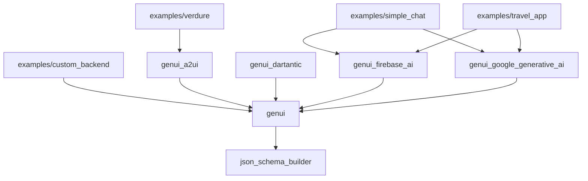

# Generative UI SDK for Flutter (genui)

A Flutter library to enable developers to easily add interactive
generative UI to their applications.

See the [Getting started with GenUI](https://www.youtube.com/watch?v=nWr6eZKM6no) video for an overview of the package.

## Status: highly experimental

This is a highly experimental package, which means the API will change (sometimes drastically).
[Feedback is very welcome](https://github.com/flutter/genui/issues/new/choose).

## Summary

Our goal for the GenUI SDK for Flutter is to help you replace static "walls of text" from your LLM with
dynamic, interactive, graphical UI.
It uses a JSON-based format to compose UIs from your existing widget catalog, turning
conversations or agent interactions into rich, intuitive experiences. State changes in the UI update
a client-side data model, which is fed back to the agent, creating a
powerful, high-bandwidth interaction loop. The GenUI SDK for Flutter aims to be easy to integrate
into your Flutter application to significantly improve the usability and satisfaction of your
chatbots and next-generation agent-based user experiences.

## High-level goals

- Increase Interaction Bandwidth for Users: allow users to interact with data and controls directly,
  making task completion faster and more intuitive. Move beyond a "wall of text".
- Simple and easy to use by developers: seamlessly integrate with your existing Flutter workflow,
  design systems, and widget catalogs.
- Drive agent-human UX forward: innovate ways to dramatically improve how users interact with their
  LLMs and Agents. Radically simplify the process of building UI-based agent interactions, by
  eliminating custom middleware between the agent and the UI layer.

## Features

* Multiple agent and LLM provider support
* A2UI support
* Standard UI catalog
* Custom widgets
* Data binding
* Chat UX
* Canvas UX

## Use cases

- Incorporate graphical UI into chatbots: instead of describing a list of products in text,
  the LLM can render an interactive carousel of product widgets. Instead of asking for a user to
  type out answers to questions, the LLM can render sliders, checkboxes, and more.
- Create dynamically composed UIs: an agent can generate a complete form with sliders, date pickers,
  and text fields on the fly based on a user's request to "book a flight."

## Look & feel

### Interactive [travel app example](examples/travel_app/)

_The GIF above shows how GenUI enables dynamic, interactive UI generation,_
_instead of text descriptions or code from a traditional AI coding agent._

### Core difference

This UI is not generated in the form of code; rather, it's generated at runtime
based on a widget catalog from the developers' project.

## Implementation goals

- **Integrate with your LLM:** Work with your chosen LLM and backend to incorporate graphical
  UI responses alongside traditional text.
- **Leverage Your Widget Catalog:** Render UI using your existing, beautifully crafted widgets
  for brand and design consistency.
- **Interactive State Feedback:** Widget state changes are sent back to the LLM, enabling a
  true interactive loop where the UI influences the agent's next steps.
- **Framework Agnostic:** Be integrated into your agent library or LLM framework of choice.
- **JSON Based:** Use a simple, open standard for UI definition—no proprietary formats.
- **Cross-Platform Flutter:** Work anywhere Flutter works (mobile, iOS, Android, Web, and more).
- **Widget Composition:** Support nested layouts and composition of widgets for complex UIs.
- **Basic Layout:** LLM-driven basic layout generation.
- **Any Model:** Integrate with any LLM that can generate structured JSON output.

## Connecting to an AI agent

The `genui` framework uses a `ContentGenerator` to communicate with a generative AI model,
allowing `genui` to be backend agnostic. You can choose the implementation that best fits
your needs, whether it's `FirebaseAiContentGenerator` for production apps,
`GoogleGenerativeAiContentGenerator` for rapid prototyping, or `A2uiContentGenerator` for
custom agent servers.

See the package table below for more details on each.

## Packages

| Package | Description | Version |
| :--- | :--- | :--- |
| [genui](packages/genui/) | The core framework to employ Generative UI. |  |
| [genui_firebase_ai](packages/genui_firebase_ai/) | Provides **`FirebaseAiContentGenerator`** to connect to Gemini via Firebase AI Logic. This is the recommended approach for production apps based on client-side agents. |  |
| [genui_google_generative_ai](packages/genui_google_generative_ai/) | Provides **`GoogleGenerativeAiContentGenerator`** for connecting to the Google Generative AI API with only an API key. Ideal for getting started quickly. |  |
| [genui_a2ui](packages/genui_a2ui/) | Provides **`A2uiContentGenerator`** for connecting to any server that implements the [A2UI protocol](https://a2ui.org). Use this for integrating with custom agent backends. |  |
| [genui_dartantic](packages/genui_dartantic/) | Integration package for genui and Dartantic AI. |  |
| [genai_primitives](packages/genai_primitives/) | A set of technology-agnostic primitive types and data structures for building Generative AI applications. |  |
| [json_schema_builder](packages/json_schema_builder/) | A fully featured Dart JSON Schema package with validation, used by the core framework to define widget data structures. |  |

### Dependencies

This diagram shows how packages depend on each other and how examples use them.

## A2UI Support

The Flutter Gen UI SDK uses the [A2UI protocol](https://a2ui.org) to represent UI content internally. The [genui_a2ui](packages/genui_a2ui/) package allows it to act as a renderer for UIs generated by an A2UI backend agent, similar to the [other A2UI renderers](https://github.com/google/A2UI/tree/main/renderers) which are maintained within the A2UI repository.

The Flutter Gen UI SDK currently supports A2UI v0.8.

## Getting started

See the [genui getting started guide](packages/genui/README.md#getting-started-with-genui).

## Constraints

This repo requires Flutter version >=3.35.7.

## Some things we're thinking about

- **Genkit Integration:** Integration with Genkit.
- **ADK Plugin:** turnkey integration with ADK.
- **Expanded LLM Framework Support:** Official support for additional LLM frameworks.
- **Streaming UI:** Support for progressively rendering UI components as they stream from the LLM.
- **Full-Screen Composition:** Enable LLM-driven composition and navigation of entire app screens.
- **A2A Agent Support:** Support for A2A agent interactions.
- **Dart Bytecode:** Future support for Dart Bytecode for even greater dynamism and flexibility.

## Contribute

See [CONTRIBUTING.md](CONTRIBUTING.md)
