# `genui` Package Implementation

This document provides a comprehensive overview of the architecture, purpose, and implementation of the `genui` package.

## Purpose

The `genui` package provides the core framework for building Flutter applications with dynamically generated user interfaces powered by large language models (LLMs). It enables developers to create conversational UIs where the interface is not static or predefined, but is instead constructed by an AI in real-time based on the user's prompts and the flow of the conversation.

The package supplies the essential components for managing the state of the dynamic UI, interacting with the AI model, defining a vocabulary of UI widgets, and rendering the UI surfaces.

## Architecture

The package is designed with a layered architecture, separating concerns to create a flexible and extensible framework. The diagram below shows how the `genui` package integrates with the developer's application and the backend LLM.

### 1. Transport Layer (`lib/src/transport/` and `lib/src/interfaces/`)

This layer handles the pipeline from raw text input (from an LLM) to parsed UI events.

- **`Transport`**: An interface defining the contract for sending and receiving messages.
- **`A2uiTransportAdapter`**: The default implementation of `Transport`. It manages the input stream (`addChunk`), the parsing pipeline, and communicates with the `Conversation`. It uses the `A2uiParserTransformer` to parse streams.
- **`A2uiParserTransformer`**: A robust stream transformer that parses mixed streams of text and A2UI JSON messages. It handles buffering, validation, and conversion of raw strings into structured `GenerationEvent`s.

### 2. UI State Management Layer (`lib/src/engine/`)

This is the central nervous system of the package, orchestrating the state of all generated UI surfaces.

- **`SurfaceController`**: The core state manager for the dynamic UI. It maintains a map of all active UI "surfaces", where each surface is represented by a `UiDefinition`. The AI interacts with the manager by sending structured A2UI messages, which the controller handles via `handleMessage()`. It exposes a stream of `SurfaceUpdate` events (`SurfaceAdded`, `ComponentsUpdated`, `SurfaceRemoved`) so that the application can react to changes. It also owns the `DataModel` to manage the state of individual widgets and implements `SurfaceHost` to provide `SurfaceContext`s for `Surface` widgets.

### 3. UI Model Layer (`lib/src/model/`)

This layer defines the data structures that represent the dynamic UI and the conversation.

- **`Catalog` and `CatalogItem`**: These classes define the registry of available UI components. The `Catalog` holds a list of `CatalogItem`s, and each `CatalogItem` defines a widget's name, its data schema, and a builder function to render it.
- **`A2uiMessage`**: A sealed class (`lib/src/model/a2ui_message.dart`) representing the commands the AI sends to the UI. It has the following subtypes:
  - `CreateSurface`: Signals the start of rendering for a surface.
  - `UpdateComponents`: Adds or updates components on a surface.
  - `UpdateDataModel`: Modifies data within the `DataModel` for a surface.
  - `DeleteSurface`: Requests the removal of a surface.
    The schemas for these messages are defined in `lib/src/model/a2ui_schemas.dart`.
- **`UiDefinition` and `UiEvent`**: `UiDefinition` represents the state of a surface, including the definitions of all components on the surface. `UiEvent` is a data object representing a user interaction. `UserActionEvent` is a subtype used for events that should trigger a submission to the AI, like a button tap.
- **`ChatMessage`**: A sealed class representing the different types of messages in a conversation: `UserMessage`, `AiTextMessage`, `ToolResponseMessage`, `AiUiMessage`, `InternalMessage`, and `UserUiInteractionMessage`.
- **`DataModel` and `DataContext`**: The `DataModel` is a centralized, observable key-value store that holds the entire dynamic state of the UI. Widgets receive a `DataContext`, which is a view into the `DataModel` that understands the widget's current scope. This allows widgets to subscribe to changes in the data model and rebuild reactively. This separation of data and UI structure is a core principle of the architecture.

### 4. Widget Catalog Layer (`lib/src/catalog/`)

This layer provides a set of core, general-purpose UI widgets that can be used out-of-the-box.

- **`core_catalog.dart`**: Defines the `CoreCatalogItems`, which includes fundamental widgets like `AudioPlayer`, `Button`, `Card`, `CheckBox`, `Column`, `DateTimeInput`, `Divider`, `Icon`, `Image`, `List`, `Modal`, `MultipleChoice`, `Row`, `Slider`, `Tabs`, `Text`, `TextField`, and `Video`.
- **Widget Implementation**: Each core widget follows the standard `CatalogItem` pattern: a schema definition, a type-safe data accessor using an `extension type`, the `CatalogItem` instance, and the Flutter widget implementation.

### 5. UI Facade Layer (`lib/src/conversation/`)

This layer provides high-level widgets and controllers for easily building a generative UI application.

- **`Conversation`**: The primary entry point for the package. This facade class encapsulates the `SurfaceController` (engine) and the `Transport`. It manages the conversation loop, piping messages between the transport and the engine.
- **`Surface`**: The Flutter widget responsible for recursively building a UI tree from a `UiDefinition`. It listens for updates from a `SurfaceContext` (typically obtained from a `SurfaceHost` like `SurfaceController`) and rebuilds itself when the definition changes.

### 6. Primitives Layer (`lib/src/primitives/`)

This layer contains basic utilities used throughout the package.

- **`logging.dart`**: Provides a configurable logger (`genUiLogger`).
- **`simple_items.dart`**: Defines a type alias for `JsonMap`.

### 7. Direct Call Integration (`lib/src/facade/direct_call_integration/`)

This directory provides utilities for a more direct interaction with the AI model, potentially bypassing some of the higher-level abstractions of `Conversation`. It includes:

- **`model.dart`**: Defines data models for direct API calls.
- **`utils.dart`**: Contains utility functions to assist with direct calls.

## How It Works: The Generative UI Cycle

The `Conversation` simplifies the process of creating a generative UI by managing the conversation loop and the interaction with the AI.

