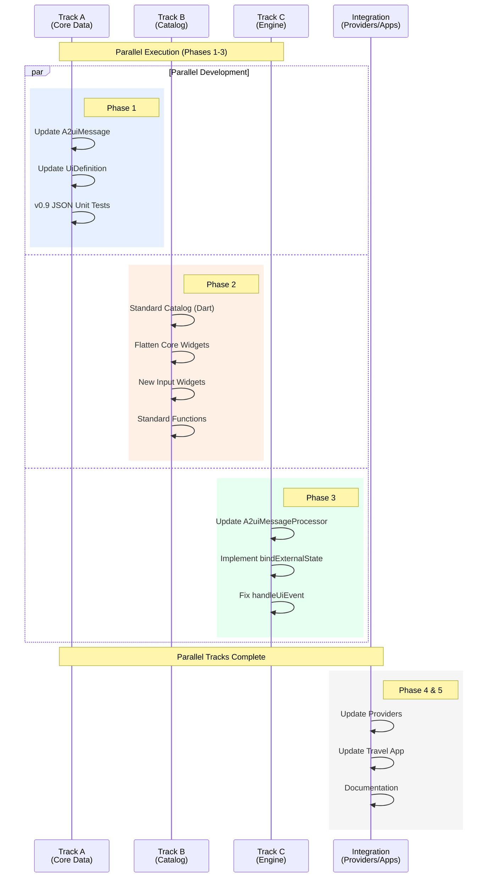

# GenUI v0.9 Migration Strategy

**Status:** Draft
**Target Protocol:** A2UI v0.9
**Current Protocol:** A2UI v0.8

**Scope:** Core `genui` package and all provider packages (`google`, `firebase`, `a2ui`, `dartantic`).

## 1. Executive Summary

The migration to A2UI v0.9 represents a fundamental shift from a "Structured Output" centric model to a "Prompt-First" model designed for LLM coherence. Concurrently, we will resolve critical "Adoption Risk" (P0) and "Friction" (P1) issues identified by customers.

**Key Architectural Shifts:**

1. **Protocol & Schema:** Transition from nested wrapper objects (e.g., `{"Text": {...}}`) to flat, property-discriminated components (`{"component": "Text", ...}`).
2. **Lifecycle:** Replace `beginRendering` with `createSurface` (enforcing strict initialization before updates).
3. **Data Binding:** Move to native JSON types for literals and a unified `path` syntax for bindings, plus support for `attachDataModel` (client-to-server state sync).
4. **Developer Experience:** Introduce strict schema enforcement, external state binding, and interceptors.

### 1.1. Execution Roadmap



## 2. Migration Management

### 2.1 Branching Strategy

Given the breaking nature of the protocol changes, **do not** attempt to migrate `main` incrementally.

- **Create a feature branch:** `feature/v0.9-migration`.
- **Reference Branch:** Keep `main` on v0.8 for maintenance fixes.
- **Dual-Spec (Temporary):** Do _not_ attempt to support v0.8 and v0.9 simultaneously in the same classes. Replace logic wholesale in the feature branch.

### 2.2 Testing Strategy

- **Snapshot Updates:** Existing "Golden" UI tests relying on v0.8 JSON structures will fail immediately. These must be regenerated using v0.9 schemas.
- **Validation First:** Before writing widget logic, implement the v0.9 `json_schema` definitions in Dart. Use these to validate test data.

## 3. Phase 1: Core Data Models & Schema (Package: `genui`)

This phase establishes the new "vocabulary" of the library. No UI rendering changes happen here, only data structure updates.

### 3.1. Update `A2uiMessage` Hierarchy

**Source:** `lib/src/model/a2ui_message.dart`

- **Rename/Replace:**
  - `BeginRendering` --> `CreateSurface`. Properties: `surfaceId`, `catalogId` (required), `theme` (replaces `styles`), `attachDataModel` (bool).
  - `SurfaceUpdate` --> `UpdateComponents`. Logic: Accepts flat component list.
  - `DataModelUpdate` --> `UpdateDataModel`. Logic: `value` is now a standard JSON object/primitive (removing the adjacency list `contents` array).

- **Logic:** Update `fromJson` parsers to handle the v0.9 discriminator fields (`createSurface`, `updateComponents`, etc.).

## 3.1.1. Class Renaming & Restructuring

The sealed class `A2uiMessage` and its subclasses must be renamed and updated to reflect the v0.9 terminology.

| v0.8 Class      | v0.9 Class       | Key Changes                                                   |
| :-------------- | :--------------- | :------------------------------------------------------------ |
| BeginRendering  | CreateSurface    | Replaces root with catalogId; adds theme and attachDataModel. |
| SurfaceUpdate   | UpdateComponents | JSON key changes; payload structure update.                   |
| DataModelUpdate | UpdateDataModel  | contents array replaced by value object.                      |
| SurfaceDeletion | DeleteSurface    | JSON key change only.                                         |

## 3.1.2. Detailed Class Definitions

### 3.1.2.1. `CreateSurface` (was `BeginRendering`)

**Old JSON:**

```jsonl
{"beginRendering": {"surfaceId": "...", "root": "...", "styles": {...}}}
```

**New JSON:**

```jsonl
{"createSurface": {"surfaceId": "...", "catalogId": "...", "theme": {...}, "attachDataModel": true}}
```

**Dart Implementation:**

```dart
final class CreateSurface extends A2uiMessage {
  const CreateSurface({
    required this.surfaceId,
    required this.catalogId,
    this.theme,
    this.attachDataModel = false,
  });

  final String surfaceId;

  /// Required in v0.9. Identifies the component/function vocabulary.
  final String catalogId;

  /// Replaces `styles`. Key-value pairs for theme tokens (e.g. primaryColor).
  final Map<String, Object?>? theme;

  /// If true, client sends full data model in A2A metadata.
  final bool attachDataModel;

  factory CreateSurface.fromJson(JsonMap json) {
    // ...
  }
}
```

### 3.1.2.2. `UpdateComponents` (was `SurfaceUpdate`)

**Old JSON:**

```jsonl
{"surfaceUpdate": {"components": [{"id": "...", "component": {"Text": ...}}]}}
```

**New JSON:**

```jsonl
{"updateComponents": {"surfaceId": "...", "components": [{"id": "...", "component": "Text", ...}]}}
```

**Dart Implementation:**

```dart
final class UpdateComponents extends A2uiMessage {
  const UpdateComponents({
    required this.surfaceId,
    required this.components,
  });

  final String surfaceId;

  // Note: Component deserialization logic changes in ui_models.dart,
  // but the list type remains the same.
  final List<Component> components;
}
```

### 3.1.2.3. `UpdateDataModel` (was `DataModelUpdate`)

**Old JSON:**

```jsonl
{ "dataModelUpdate": { "contents": [{ "key": "foo", "valueString": "bar" }] } }
```

**New JSON:**

```jsonl
{ "updateDataModel": { "path": "/foo", "value": "bar" } }
```

**Dart Implementation:**

```dart
final class UpdateDataModel extends A2uiMessage {
  const UpdateDataModel({
    required this.surfaceId,
    this.path = '/',
    this.value,
  });

  final String surfaceId;

  /// Defaults to root '/' if omitted.
  final String path;

  /// Raw JSON value (String, Number, Boolean, Map, List, null).
  /// Replaces the adjacency list `contents`.
  final Object? value;
}
```

### 3.1.3. Parser Logic (`A2uiMessage.fromJson`)

The static `fromJson` factory must be updated to switch on the new v0.9 keys.

```dart
factory A2uiMessage.fromJson(JsonMap json) {
  if (json.containsKey('createSurface')) {
    return CreateSurface.fromJson(json['createSurface'] as JsonMap);
  }
  if (json.containsKey('updateComponents')) {
    return UpdateComponents.fromJson(json['updateComponents'] as JsonMap);
  }
  if (json.containsKey('updateDataModel')) {
    return UpdateDataModel.fromJson(json['updateDataModel'] as JsonMap);
  }
  if (json.containsKey('deleteSurface')) {
    return DeleteSurface.fromJson(json['deleteSurface'] as JsonMap);
  }
  // Legacy support or Error
  throw ArgumentError('Unknown A2UI message type: ${json.keys}');
}
```

### 3.2. Refactor `Component` and `UiDefinition`

**Source:** `lib/src/model/ui_models.dart`

- **Flattening:** Remove the nested component wrapper logic.
  - _Old:_ `{ "component": { "Text": { ... } } }`
  - _New:_ `{ "component": "Text", ... }`

- **Validation:** Implement `ENH-002 (Schema-Enforced DataModel)`.
  - Add `validationSchema` support to `UiDefinition`.
  - If the parser encounters invalid types (e.g., String where Number expected), it should throw a specific `ValidationException` that can be caught later to send a `ValidationFailed` error back to the LLM.

### 3.2.1. `Component` Class Refactor

A2UI v0.9 moves from a nested wrapper structure to a flat structure with a discriminator field.

**Old Structure (v0.8):**

```json
{
  "id": "myText",
  "component": {
    "Text": {
      "text": "Hello"
    }
  }
}
```

**New Structure (v0.9):**

```json
{
  "id": "myText",
  "component": "Text",
  "text": "Hello"
}
```

### 3.2.1.1. Changes to `Component`

- **Properties:** Remove `componentProperties` (the nested map). Add `type` (read from `component` field) and `properties` (the rest of the JSON).
- **Constructor:**

```dart
final class Component {
  const Component({
    required this.id,
    required this.type,
    required this.properties,
  });

  final String id;

  /// The component type (e.g., 'Text', 'Button').
  /// Corresponds to the "component" field in JSON.
  final String type;

  /// All other properties from the JSON object (text, style, children, etc.).
  final JsonMap properties;

  // ...
}
```

- **Parser (`fromJson`):**

```dart
factory Component.fromJson(JsonMap json) {
  final id = json['id'] as String;
  final type = json['component'] as String;

  // Create a copy of the map to use as properties, excluding structural keys.
  final properties = Map<String, Object?>.from(json);
  properties.remove('id');
  properties.remove('component');

  return Component(
    id: id,
    type: type,
    properties: properties,
  );
}
```

## 3.2.2. `UiDefinition` Class Refactor

### 3.2.2.1. Lifecycle Updates

- **Remove:** `rootComponentId`. v0.9 does not declare the root in `createSurface` (previously `beginRendering`). Instead, the client MUST look for a component with `id: "root"` inside the `components` map.
- **Add:** `theme` (replacing `styles`).

### 3.2.2.2. Changes to `UiDefinition`

```dart
class UiDefinition {
  final String surfaceId;

  // v0.9: Explicitly required in CreateSurface
  final String? catalogId;

  // v0.9: Replaces `styles`
  final JsonMap? theme;

  final Map<String, Component> components;

  /// Helper to find the root component.
  /// In v0.9, the root is implicitly the component with id="root".
  Component? get rootComponent => components['root'];
}
```

### 3.2.3. `UserActionEvent` Updates

**Target:** `UserActionEvent` (and `UiEvent` extension type) **Goal:** Align event context with v0.9 simple map structure.

- **Context Structure:**
  - **Old:** `context` was often derived from an array of key/value pairs in the schema.
  - **New:** `context` is a standard `JsonMap`.

- **Change:** Ensure `UserActionEvent.context` allows arbitrary JSON values (not just primitives), as v0.9 allows passing objects back to the LLM.

### 3.2.4. Validation (ENH-002)

To support `ValidationFailed` error reporting:

1. Add a `validate()` method to `UiDefinition` or a standalone validator class.
2. This method should accept a `JsonSchema` (the Catalog definition).
3. It should validate the raw JSON of the components against the schema.
4. If validation fails, throw a `GenUiValidationException` containing the specific path and error message, which `A2uiMessageProcessor` can catch and send back to the LLM.

### 3.3. Modernize `DataModel`

**Source:** `lib/src/model/data_model.dart`

- **Native Types:** Remove parsing logic for `valueString`, `valueNumber`, `valueMap`. The `updateDataModel` message now sends standard JSON. `DataModel` should simply merge the JSON payload into the store.

- **ENH-001 (External Binding):** Implement the `bindExternalState` API.
  - Add `externalBindings` map to `DataModel`.
  - Allow injection of `ValueListenable` or `Stream` from the host app.
  - When external streams emit, update the local `DataModel` and trigger widget rebuilds.

## 3.3.1. Remove Adjacency List Parsing

A2UI v0.8 required parsing a complex array of objects like `{"key": "foo", "valueString": "bar"}`. v0.9 sends standard JSON.

### 3.3.1.1. Simplification

- **Delete:** `_parseDataModelContents` method.

- **Update:** `update(DataPath? absolutePath, Object? contents)`
  - Previously the `contents` was a List (the adjacency list).

  - Now the `contents` (`value` in v0.9 message) is `Object?` (any JSON type).

  - **Logic:**
    1. If the `path` is root (`/`), cast `contents` to `Map<String, Object?>` and replace/merge with root data.
    2. If the `path` is specific (e.g., `/user/name`), set that value directly in the internal Map.

### 3.3.2. External State Binding (ENH-001)

We need a way to link the internal `DataModel` (which drives the UI) with the host application's state management (Provider, ValueNotifier, Stream, etc.).

### 3.3.2.1. New API: `bindExternalState`

Add the following method to `DataModel`:

```dart
final List<StreamSubscription> _externalSubscriptions = [];

  /// Binds an external [ValueListenable] to a path in this DataModel.
  ///
  /// When the [source] changes, the [path] in this model is updated automatically.
  /// This allows the GenUI surface to react to app-state changes.
  void bindExternalState<T>({
    required DataPath path,
    required ValueListenable<T> source,
    bool twoWay = false,
  }) {
    // Initial sync
    update(path, source.value);

    // Listen for external changes -> Update GenUI
    void listener() {
      // Avoid loops if two-way
      final currentValue = getValue<T>(path);
      if (currentValue != source.value) {
         update(path, source.value);
      }
    }
    source.addListener(listener);

    // Store disposal logic (conceptually - ValueListenable doesn't return a subscription,
    // so we might need a wrapper or RemoveListener callback storage).
  }
```

_Note: For `Stream` support, a similar method `bindExternalStream` would be added._

### 3.3.2.2. Two-Way Sync Logic (Optional/Advanced)

If `twoWay` is true, the `DataModel` needs to notify the external source when the _GenUI_ updates the value (e.g., user types in a field bound to that path).

1. **Add Listener to Internal Path:** Use `subscribeToValue(path)`.
2. **Callback:** When internal value changes, update `source.value` (if `source` is a `ValueNotifier` and not just a `ValueListenable`).
3. **Loop Prevention:**
   - Ensure updates check inequality (`current != new`) before setting values.
   - Use an update origin flag (e.g. `update(path, value, {bool isInternal = true})`) to distinguish between internal GenUI updates and external host updates, ensuring that we only notify the external listener if the update originated internally.

### 3.3.3. Resource Management (BUG-001)

The `DataModel` holds `ValueNotifier`s and potentially external listeners. It needs a cleanup lifecycle.

### 3.3.3.1. Add `dispose()`

```dart
void dispose() {
    for (final notifier in _subscriptions.values) {
      notifier.dispose();
    }
    for (final notifier in _valueSubscriptions.values) {
      notifier.dispose();
    }
    // Cancel external bindings
    for (final sub in _externalSubscriptions) {
      sub.cancel();
    }
    _subscriptions.clear();
    _valueSubscriptions.clear();
    _externalSubscriptions.clear();
  }
```

### 3.4. Update `standard_catalog.json` Definitions

**Source:** `lib/src/model/a2ui_schemas.dart`

- Update all `Schema` definitions to match v0.9 `standard_catalog.json`.

- **Action Context:** Change context from `[{"key": "...", "value": ...}]` to a simple JSON object map `{ "key": "value" }`.

- **Renames:**
  - `usageHint` --> `variant`.
  - `distribution` --> `justify`.
  - `alignment` --> `align`.

### 3.4.1. Message Envelope Schemas

The static schema generators in `A2uiSchemas` must output the v0.9 structure.

### 3.4.1.1. `createSurfaceSchema` (was `beginRenderingSchema`)

- **Properties:**
  - `surfaceId` (String)
  - `catalogId` (String, required)
  - `theme` (Object, optional) - _Not_ `styles`
  - `attachDataModel` (Boolean, optional)

- **Required:** `['surfaceId', 'catalogId']` (Root is no longer required here).

### 3.4.1.2. `updateComponentsSchema` (was `surfaceUpdateSchema`)

- **Properties:**
  - `surfaceId` (String)

  - `components` (Array)
    - **Items:** Schema must use `oneOf` matching the catalog definitions, but **flattened**.
    - The schema should validate that items have: `{"id": ..., "component": ...}`.

### 3.4.1.3. `updateDataModelSchema` (was `dataModelUpdateSchema`)

- **Properties:**
  - `surfaceId` (String)
  - `path` (String, default '/')
  - `value` (Any) - _Not_ `contents` array.

### 3.4.2. Component Schema Updates

These changes affect the `CatalogItem` definitions in `lib/src/catalog/core_widgets/*.dart` (referenced by `A2uiSchemas`).

### 3.4.2.1. Flattening Logic

The schema generation logic in `Catalog.definition` currently wraps properties in a named object (e.g., `Text: {...}`).

- **Change:** It must generate a schema where the `component` is a `const` property, and other properties are siblings.

**Example (Text Schema):**

```dart
S.object(
  properties: {
    'id': S.string(),
    'component': S.constant('Text'), // Discriminator
    'text': ...,
    'variant': ...
  },
  required: ['id', 'component', 'text']
)
```

### 3.4.2.2. Property Renames

Update the helper methods in `A2uiSchemas` to generate v0.9 property names.

- `usageHint` -\> `variant`
- `distribution` -\> `justify`
- `alignment` -\> `align`
- `entryPointChild` -\> `trigger` (Modal)
- `contentChild` -\> `content` (Modal)
- `tabItems` -\> `tabs` (Tabs)
- `text` (TextField input) -\> `value`

### 3.4.2.3. Action Context

Update `A2uiSchemas.action()`:

- **Old:** Array of `{key, value}` objects.
- **New:** Simple Object/Map. `S.map(...)` or `S.object(additionalProperties: true)`.

### 3.4.2.4. Data Binding Schema

Update `A2uiSchemas.stringReference`, `numberReference`, etc.

- v0.9 allows `"text": "literal"` OR `"text": {"path": "..."}`.
- Remove explicit keys like `literalString`, `literalNumber`.
- The schema should use `oneOf`: `[S.string(), S.object(properties: {'path': S.string()})]`.

### 3.4.3. Function Definitions (Client-Side)

Add schema generation for the functions supported by the client (v0.9 feature).

- `formatString`
- `required`, `regex`, `email` (for validation)
- `openUrl`
- `length`, `numeric`
- `formatNumber`, `formatCurrency`, `formatDate`, `pluralize`

These should be added to a new section in the Catalog definition schema (`functions` array).

### 3.5. Phase 1 Success Criteria

- [ ] `A2uiMessage` subclasses (`CreateSurface`, `UpdateComponents`, `UpdateDataModel`, `DeleteSurface`) are implemented and strictly typed to v0.9 spec.
- [ ] `Component` and `UiDefinition` classes are refactored to support the flattened structure (discriminator + properties).
- [ ] `DataModel` supports storing and retrieving native JSON types (Map, List, primitives) without "valueString" wrappers.
- [ ] `DataModel` `bindExternalState` API is defined and unit tested (mock listeners).
- [ ] `A2uiSchemas` generates schemas matching `server_to_client.json` and `standard_catalog.json` identically.
- [ ] Unit tests for JSON serialization/deserialization of all new message types pass.

## 4. Phase 2: Widget Catalog & Rendering (Package: `genui`)


This phase updates how JSON is converted into Flutter Widgets.

### 4.1. Core Catalog Widget Updates

**Source:** `lib/src/catalog/core_widgets/*.dart`

- **Update Builders:** Update every `widgetBuilder` to look for properties at the root of the data object, rather than inside a type key.

- **New Props:** Update specific widgets:
  - `Row`/`Column`: Map `justify`/`align` to Flex properties.
  - `Button`: Support `variant: "primary" | "borderless"`.
  - `TextField`: Rename `text` --> `value`. Implement `checks` array (replacing `validationRegexp`).

- **New Widgets:**
  - `ChoicePicker`: Replace `MultipleChoice`. Handle `variant: "multipleSelection" | "mutuallyExclusive"`.

- **Friction Items:**
  - **ENH-017 (Close Modal):** Add a client-side function/action `closeModal` to the default capabilities.
  - **ENH-018 (Tabs):** Update `Tabs` schema to bind `activeTab` index to `DataModel`, allowing the AI to switch tabs.

## 4.1.1. Overview of Changes

Each widget definition in `lib/src/catalog/core_widgets/` needs updates in three areas:

- **Schema (`_schema`):** Must reflect the flattened v0.9 properties (no wrapper object).
- **Data Helper (`_ExtensionType`):** Must read properties from the root of the JSON map.
- **Widget Builder:** Must use the updated data helper and handle new property names/types.

## 4.1.2. General Pattern Change

**Old (v0.8):**

```dart
final _schema = S.object(
  properties: {
    'text': ...,
  }
);
// ...
extension type _TextData.fromMap(JsonMap _json) {
  // Reads from _json['text']
}
```

_Note: In v0.8, the Catalog.definition logic wrapped this in a `Text` object. In v0.9, we must define the component type constant in the schema explicitly if we want strict validation, or simply define the properties that sit alongside the `component: "Text"`._

**New (v0.9):**

```dart
final _schema = S.object(
  properties: {
    'component': S.constant('Text'),
    'text': ...,
    'variant': ..., // Was usageHint
  },
  required: ['component', 'text']
);

// Data helper reads directly from the root map
extension type _TextData.fromMap(JsonMap _json) {
   String get type => _json['component'] as String;
   // ...
}
```

## 4.1.3. Specific Widget Updates

### 4.1.3.1. `Text` (`text.dart`)

- **Properties:**
  - `usageHint` --> `variant`.
  - **New Variants:** `h1`-`h5`, `caption`, `body`.

- **Schema:**

```dart
'text': A2uiSchemas.stringReference(), // Uses new oneOf schema
'variant': S.string(enumValues: [...])
```

### 4.1.3.2. `Button` (`button.dart`)

- **Properties:**
  - `primary` (bool) --> `variant` (enum: `primary`, `borderless`).

- **Logic:**
  - If `variant == 'primary'`, use filled style.
  - If `variant == 'borderless'`, use text button style.
  - Default is standard/outlined.

### 4.1.3.3. `TextField` (`text_field.dart`)

- **Properties:**
  - `text` --> `value`.
  - `validationRegexp` --> `checks` (Array of `CheckRule`).

- **Logic:**
  - Bind `value` using `subscribeToString`.
  - Implement validation logic using the `checks` array (requires `FunctionRegistry` from Phase 2.2).

### 4.1.3.4. `Row` & `Column` (`row.dart`, `column.dart`)

- **Properties:**
  - `distribution` --> `justify`.
  - `alignment` --> `align`.

- **Mapping:** Update `_parseMainAxisAlignment` and `_parseCrossAxisAlignment` to handle new string values.

- **Layout Weight:**
  - In v0.9, `weight` is a sibling property in the `components` list, not a "meta" property on the parent wrapper.
  - The `Row`/`Column` builders must look for `weight` on the child component definitions directly when building the children (wrapping them in `Expanded`).

### 3.5. `Modal` (`modal.dart`) - **Friction Fix ENH-017**

- **Properties:**
  - `entryPointChild` --> `trigger`.
  - `contentChild` --> `content`.

- **Logic:**
  - The `trigger` widget builder remains the same.
  - **New:** Add `CloseModal` action support. If a child inside the modal triggers an action named `closeModal`, the `GenUiSurface` or `UserAction` handler should pop the navigator.

### 4.1.3.6. `Tabs` (`tabs.dart`) - **Friction Fix ENH-018**

- **Properties:**
  - `tabItems` --> `tabs`.

- **New Property:** `activeTab` (Integer, bindable).

- **Logic:**
  - Bind `activeTab` to `TabController.index`.
  - When the user switches tabs, update `DataModel`.
  - When `DataModel` updates, animate `TabController`.

### 4.1.3.7. `ChoicePicker` (Replaces `MultipleChoice`)

- **File:** `choice_picker.dart` (New/Renamed).

- **Properties:**
  - `selections` --> `value` (List).
  - `maxAllowedSelections` removed.
  - `variant`: `multipleSelection` (Checkbox) or `mutuallyExclusive` (Radio).

### 4.1.3.8. `DateTimeInput` (`date_time_input.dart`)

- **Properties:**
  - `firstDate` / `lastDate` --> `min` / `max` (ISO8601 strings).

- **Logic:** Update parsing to support full ISO strings for min/max.

### 4.1.4. Updates to `CoreCatalogItems` (`core_catalog.dart`)

- Update references to renamed files/classes.
- Ensure `choicePicker` is exported instead of `multipleChoice`.

### 4.2. Implement Client-Side Functions

**Source:** `lib/src/core/functions.dart` (New File)

- **Context:** v0.9 introduces functions like `formatString`, `required`, `regex` that run on the client.

- **Implementation:** Create a `FunctionRegistry`.
  - Implement `formatString` handling `${path}` interpolation and nested function calls.
  - Implement `openUrl`.
  - Implement validation functions (`required`, `email`, `regex`) for Input components.
  - Implement a full set of standard functions: `length`, `numeric`, `formatNumber`, `formatCurrency`, `formatDate`, `pluralize`.

### 4.2.1. New Class: `FunctionRegistry`

A singleton or scoped service to manage available functions.

```dart
typedef ClientFunction = Object? Function(List<Object?> args);

class FunctionRegistry {
  final Map<String, ClientFunction> _functions = {};

  void register(String name, ClientFunction function) {
    _functions[name] = function;
  }

  Object? invoke(String name, List<Object?> args) {
    final func = _functions[name];
    if (func == null) {
      throw Exception('Function $name not found');
    }
    return func(args);
  }
}
```

### 4.2.2. Standard Functions Implementation

Implement the functions defined in `standard_catalog.json`.

### 4.2.2.1. `formatString`

- **Signature:** `string formatString(string template, ...args)`

- **Logic:**
  - Takes a template string with placeholders (e.g., `Hello ${0}, your score is ${1}`).
  - Note: The protocol definition uses `${path}` or `${func()}`. The _client_ implementation of `formatString` receives resolved values as arguments if the parser handles interpolation beforehand.
  - _Correction:_ The v0.9 spec says `formatString` does the interpolation. This implies the arguments are the values to plug in, OR the function itself parses the string.
  - **Dart Implementation:**

```dart
String formatString(List<Object?> args) {
   final template = args[0] as String;
   // If the template expects positional args like standard format:
   // Replace placeholders with args[1..n]
}
```

- _Refinement:_ A2UI v0.9 uses `${expression}` syntax. The `DataModel` or `DataContext` needs a way to evaluate these expressions. `formatString` might just be a helper, or the _engine_ might handle `${...}` natively before calling functions. _Decision:_ Implement `ExpressionEvaluator` in `DataContext` that handles `${...}`.

### 4.2.2.2. Validation Functions (`checks`)

These return `boolean` and are used in Input components.

- **`required(value)`**: Returns `true` if value is not null/empty.
- **`regex(value, pattern)`**: Returns `true` if matches.
- **`email(value)`**: Simple regex check.
- **`length(value, {min, max})`**: Check string/list length.
- **`numeric(value, {min, max})`**: Check number range.

### 4.2.2.3. Utility

- **`openUrl(url)`**: Calls `url_launcher`.

### 4.2.2.4. Additional Standard Functions

Implement remaining functions from `standard_catalog.json` to ensure full compliance:

- `formatNumber`, `formatCurrency`, `formatDate` (using `intl` package).
- `pluralize` (using `intl` package).

## 4.2.3. Integration with `DataModel` & `Components`

### 4.2.3.1. `DataContext.resolveValue`

Update `DataContext` (or create a helper) to handle `FunctionCall` objects in the JSON.

**Structure:**

```json
{
  "call": "formatString",
  "args": ["Hello ${name}", ...]
}
```

**Logic:**

1. Detects if a value is a `FunctionCall` map (has a call key).
2. Resolve arguments (recursively, as args can be paths/literals).
3. Invoke function via `FunctionRegistry`.

### 4.2.3.2. Expression Parsing

Implement a robust recursive descent parser for the `${...}` syntax.

- **Capabilities:**
  - Handle nested braces (e.g. `${func(${path})}`).
  - Handle escaped dollar signs (`\$`) to treat them as literals.
  - Support data bindings (paths), function calls, and string/number literals.
  - **No** support for math, conditional blocks, or iterative loops.

- **Safeguards:**
  - **Recursion Limit:** Enforce a maximum recursion depth of 10 to prevent stack overflow.
  - **Cycle Detection:** Track active resolutions in the current chain to detect and break infinite loops (e.g. binding A -> B -> A).

## 4.2.4. `FunctionCall` Schema

Ensure `A2uiSchemas` generates the schema for function calls so the LLM knows how to structure them.

### 4.3. Phase 2 Success Criteria

- [ ] All standard catalog widgets (`Text`, `Button`, `Row`, `Column`, `List`, `Card`, `Tabs`, `Modal`, `Divider`, `TextField`, `CheckBox`, `Slider`, `ChoicePicker`, `DateTimeInput`) are updated to read flattened properties.
- [ ] New widget properties (`variant`, `justify`, `align`, `checks`) are fully implemented and visible in rendered UI.
- [ ] `FunctionRegistry` is implemented and accessible to `ContentGenerator` / `DataContext`.
- [ ] All Standard Functions (`required`, `regex`, `length`, `numeric`, `email`, `formatString`, `openUrl`, `formatNumber`, `formatCurrency`, `formatDate`, `pluralize`) are implemented and unit tested.
- [ ] `ExpressionParser` correctly handles nested interpolations (`${func(${path})}`) and escaped characters, with cycle detection and recursion limits verified by tests.
- [ ] "Golden" widget tests are updated to v0.9 JSON and pass.

## 5. Phase 3: The Engine & Logic (Package: `genui`)


This phase manages the lifecycle and communication flow.

### 5.1. `A2uiMessageProcessor` Overhaul

**Source:** `lib/src/core/a2ui_message_processor.dart`

- **Lifecycle Enforcement:** Throw an error if `UpdateComponents` is received for a `surfaceId` that hasn't received `CreateSurface` yet (v0.9 strictness).
- **ENH-005 (Ordering):** Implement an internal buffer. If `UpdateComponents` arrives in the same "turn" or batch but _before_ `CreateSurface`, buffer it and apply it immediately after creation.
- **ENH-014 (Surface Cleanup):** Implement `SurfaceCleanupPolicy` (e.g., keep max N surfaces) to automatically issue local `SurfaceDeletion` events.
- **Validation Loop:** If `DataModel` or `UiDefinition` throws a `ValidationException` (from Phase 1), catch it here. Instead of crashing, generate a `ValidationFailed` message payload to be sent back to the AI.
- **Protocol Update (v0.9):** Update `handleUiEvent` to use the key `action` instead of `userAction` when constructing the JSON payload, to comply with the v0.9 `client_to_server.json` schema.

## 5.1.1. Lifecycle Enforcement & Buffering (ENH-005)

A2UI v0.9 requires `CreateSurface` before any `UpdateComponents` or `UpdateDataModel`. Due to LLM generation order issues, we must buffer updates that arrive "too early" in the same turn.

### 5.1.1.1. Internal Buffer

Add a buffer to store pending messages for unknown surfaces.

```dart
final _pendingUpdates = <String, List<A2uiMessage>>{};
```

### 5.1.1.2. Updated `handleMessage` Logic

1. **`CreateSurface`:**
   - Create the surface (notify listeners).
   - **Check Buffer:** If `_pendingUpdates` has entries for this `surfaceId`, process them immediately in order, then clear the buffer.
   - **Strictness:** If a surface with this ID already exists, log a warning (or error, depending on strict mode configuration) but allow re-initialization (update catalog/theme).

2. **`UpdateComponents` / `UpdateDataModel`:**
   - Check if surface exists in `_surfaces`.

   - **If Yes:** Process normally.

   - **If No:**
     - **Buffer:** Add message to `_pendingUpdates[surfaceId]`.
     - **Timeout/Warning:** Schedule a task to warn and clear the buffer if `CreateSurface` never arrives.
       - **Default Duration:** 1 minute (configurable), to account for LLM generation latency.
       - **Action:** Clear pending updates for that ID and log a warning to `genUiLogger`.

3. **`DeleteSurface`:**
   - Remove the surface.
   - Remove any pending updates from the buffer.

### 5.1.2. Automatic Surface Cleanup (ENH-014)

Implement a policy to prevent unbounded surface growth.

### 5.1.2.1. `SurfaceCleanupPolicy`

Add a configuration to `A2uiMessageProcessor`:

```dart
enum SurfaceCleanupPolicy {
  manual, // Default: Wait for DeleteSurface
  keepLatest, // Keep only the most recently created/updated surface
  keepLastN, // Keep the last N surfaces
}

class A2uiMessageProcessor {
  A2uiMessageProcessor({
    required this.catalogs,
    this.cleanupPolicy = SurfaceCleanupPolicy.manual,
    this.maxSurfaces = 1, // Used for keepLastN
  });

  final SurfaceCleanupPolicy cleanupPolicy;
  final int maxSurfaces;
}
```

### 5.1.2.2. Enforcement Logic

Inside `_handleCreateSurface` (or `SurfaceUpdate`):

1. If `cleanupPolicy` is `keepLatest` or `keepLastN`:
   - Check `_surfaces.length`.
   - If the limit is exceeded, identify oldest surfaces (by creation time or last update).
   - Call `_deleteSurface(oldestId)` internally.
   - Emit `SurfaceRemoved` event.

### 5.1.3. Validation Loop (ENH-002 Integration)

Catch validation errors thrown by `UiDefinition` or `DataModel` (from Phase 1 & 2).

### 5.1.3.1. Error Handling

Wrap message processing in a try-catch block.

```dart
try {
  // ... process message ...
} on GenUiValidationException catch (e) {
  // Construct ValidationFailed error
  final errorMsg = {
    'error': {
      'code': 'VALIDATION_FAILED',
      'surfaceId': e.surfaceId,
      'path': e.path,
      'message': e.message,
    }
  };
  // Send back to LLM via onSubmit stream (as a system/error message)
  // Note: This requires expanding UserUiInteractionMessage or adding a new message type.
  _onSubmit.add(UserUiInteractionMessage.error(errorMsg));
}
```

_Note: Requires updating `UserUiInteractionMessage` to support error payloads or adding a specific `SystemErrorMessage`._

### 5.2. Event & State Synchronization

**Source:**

- `lib/src/facade/gen_ui_conversation.dart`

- `lib/src/model/ui_models.dart`

- `lib/src/model/a2ui_client_data_model.dart`

- **Attach Data Model:** Check the `attachDataModel` flag from `CreateSurface`.
  - If true, when generating a `UserMessage` (action), serialize the _entire_ relevant `DataModel` into the metadata of the request.

- **ENH-003 (Observability):**
  - Refactor `ContentGenerator` streams.
  - Add `Stream<GenUiEvent> eventStream`.
  - Emit events for `ToolStart`, `ToolEnd`, `TokenUsage`, `Thinking`.

### 5.2.1. `attachDataModel` Implementation

A2UI v0.9 allows the server to request that the client attach the full data model to every request metadata.

### 5.2.1.1. Tracking Attached Surfaces

`A2uiMessageProcessor` needs to track which surfaces have requested attachment.

```dart
// In A2uiMessageProcessor
final _attachedSurfaces = <String>{};

void _handleCreateSurface(CreateSurface message) {
  if (message.attachDataModel) {
    _attachedSurfaces.add(message.surfaceId);
  }
  // ...
}

Map<String, Object?> getClientDataModel() {
  final result = <String, Object?>{};
  for (final surfaceId in _attachedSurfaces) {
    if (_dataModels.containsKey(surfaceId)) {
      result[surfaceId] = _dataModels[surfaceId]!.data;
    }
  }
  return {'surfaces': result};
}
```

### 5.2.1.2. Sending Metadata (`GenUiConversation`)

When `sendRequest` is called (either manually or via `onSubmit` from an action):

1. Call `a2uiMessageProcessor.getClientDataModel()`.
2. Wrap this in the `A2UiClientDataModel` structure.
3. Pass it to `ContentGenerator.sendRequest` (requires API update to `sendRequest` or `clientCapabilities` argument expansion).

**API Update:**

```dart
// ContentGenerator.sendRequest
Future<void> sendRequest(
  ChatMessage message, {
  Iterable<ChatMessage>? history,
  A2UiClientCapabilities? clientCapabilities,
  // NEW:
  Map<String, Object?>? clientDataModel,
});
```

The `ContentGenerator` implementation (e.g., `A2uiAgentConnector` or `GoogleGenerativeAiContentGenerator`) must then place this map into the appropriate transport metadata field (e.g., A2A `metadata` or an extension field).

### 5.2.2. Observability (ENH-003)

Expand `ContentGenerator` to emit typed events about the generation process.

### 5.2.2.1. `GenUiEvent` Hierarchy

Create a new file `lib/src/model/gen_ui_events.dart`.

```dart
sealed class GenUiEvent {}

class ToolStartEvent extends GenUiEvent {
  final String toolName;
  final Map<String, Object?> args;
}

class ToolEndEvent extends GenUiEvent {
  final String toolName;
  final Object? result;
  final Duration duration;
}

class TokenUsageEvent extends GenUiEvent {
  final int inputTokens;
  final int outputTokens;
}

class ThinkingEvent extends GenUiEvent {
  final String content;
}
```

### 5.2.2.2. `ContentGenerator` Updates

- **Add Stream:** `Stream<GenUiEvent> get eventStream;`
- **Implement:** Update `FirebaseAiContentGenerator` and `GoogleGenerativeAiContentGenerator` to emit these events during their generation loops (e.g., before/after `tool.invoke`, when `usageMetadata` is received).

### 5.2.2.3. `GenUiConversation` Updates

Expose this stream to the app developer.

```dart
Stream<GenUiEvent> get processingEvents => contentGenerator.eventStream;
```

### 5.3. Tooling & Interceptors

**Source:** `lib/src/content_generator.dart`

- **ENH-004 (Interceptors):** Add `List<ToolInterceptor> interceptors` to `ContentGenerator`.
  - Before executing `invoke` on a tool, run interceptors. Allow them to `cancel`, `proceed`, or `mock` the result.

### 5.3.1. Interceptor API Definition

Define the contract for intercepting tool calls.

```dart
/// Represents an action to take for an intercepted tool call.
sealed class ToolAction {}

/// Proceed with the tool execution as normal.
class ToolActionProceed extends ToolAction {}

/// Cancel the tool execution. The AI will receive an error or a cancellation message.
class ToolActionCancel extends ToolAction {
  final String reason;
  ToolActionCancel(this.reason);
}

/// Skip execution and provide a mock result to the AI.
class ToolActionMock extends ToolAction {
  final Map<String, Object?> result;
  ToolActionMock(this.result);
}

/// A function that intercepts a tool call.
/// [toolName]: The name of the tool being called.
/// [args]: The arguments passed by the AI.
typedef ToolInterceptor = Future<ToolAction> Function(String toolName, Map<String, Object?> args);
```

### 5.3.2. Integration into `ContentGenerator`

The `ContentGenerator` interface needs to accept these interceptors.

### 5.3.2.1. Constructor/Setter

Add `interceptors` list to `ContentGenerator` implementations (or the base interface if possible, though implementations handle execution).

```dart
abstract class ContentGenerator {
  // ... existing members ...

  /// Adds a tool interceptor.
  void addInterceptor(ToolInterceptor interceptor);

  /// Removes a tool interceptor.
  void removeInterceptor(ToolInterceptor interceptor);
}
```

### 5.3.2.2. Execution Logic (In `GoogleGenerativeAiContentGenerator` etc.)

Inside the `_processFunctionCalls` loop (or equivalent):

```dart
for (final call in functionCalls) {
  // 1. Run Interceptors
  bool shouldProceed = true;
  for (final interceptor in _interceptors) {
    final action = await interceptor(call.name, call.args);

    if (action is ToolActionCancel) {
      // Return error to AI
      toolResult = {'error': 'Tool execution cancelled: ${action.reason}'};
      shouldProceed = false;
      break;
    } else if (action is ToolActionMock) {
      // Return mock result to AI
      toolResult = action.result;
      shouldProceed = false;
      break;
    }
  }

  if (!shouldProceed) {
     // Add toolResult to response parts and continue to next call
     functionResponseParts.add(...);
     continue;
  }

  // 2. Invoke Tool (Existing Logic)
  // ...
}
```

### 5.3.3. Usage Examples

### 5.3.3.1. Confirmation Dialog

```dart
// App Code
generator.addInterceptor((name, args) async {
  if (name == 'deleteSurface') {
    final confirmed = await showDialog(...); // Ask user
    return confirmed ? ToolActionProceed() : ToolActionCancel("User denied");
  }
  return ToolActionProceed();
});
```

### 5.3.3.2. Security / PII Filter

```dart
generator.addInterceptor((name, args) async {
  if (args.toString().contains('password')) {
     return ToolActionCancel("Sensitive data detected");
  }
  return ToolActionProceed();
});
```

### 5.4. Phase 3 Success Criteria

- [ ] `A2uiMessageProcessor` throws an exception if `UpdateComponents` is received for a non-existent surface (strict ordering).
- [ ] Out-of-order `UpdateComponents` messages (arriving before `CreateSurface`) are buffered and applied correctly once the surface is created.
- [ ] `SurfaceCleanupPolicy` (manual, keepLatest, keepLastN) is implemented and verified with tests.
- [ ] `GenUiValidationException` from the parser is caught and transformed into a valid `validation_failed` error message payload.
- [ ] `ContentGenerator` emits `ToolStart`, `ToolEnd`, `TokenUsage`, and `Thinking` events via `eventStream`.
- [ ] Tool Interceptors (mock, cancel, proceed) function correctly and are covered by tests.
- [ ] `attachDataModel` accurately serializes the client state into transport metadata.

## 6. Phase 4: Provider Packages Update


Each provider package must be updated to support the "Prompt-First" nature of v0.9 and the new schema.

### 6.1. `genui_google_generative_ai` & `genui_firebase_ai`

- **System Prompt:** The default behavior should no longer rely solely on `FunctionDeclarations` to teach the model the UI protocol.
  - Inject `standard_catalog.json` and `standard_catalog_rules.txt` into the `systemInstruction`.
  - _Recommendation:_ Keep using Google's `FunctionCalling` for the actual transport of JSON, but align the `FunctionDeclaration` schema _exactly_ with the v0.9 `server_to_client.json`.

- **Tools:**
  - Update `SurfaceUpdateTool` schema to v0.9.
  - Update `CreateSurfaceTool` schema.

- **ENH-006 (Unified Client):** Expose `getUnderlyingClient()` or similar to allow access to the raw `GenerativeModel` for non-UI tasks.

### 6.1.1. Schema & Prompt Injection

A2UI v0.9 relies on injecting the schema into the system prompt rather than just function declarations.

*Recommendation:* To mitigate token costs, cache the constructed system instruction where possible, or utilize provider-specific "Context Caching" features if the `standard_catalog.json` size is significant.

### 6.1.1.1. `standard_catalog.json` Integration

The `standard_catalog.json` and `standard_catalog_rules.txt` files must be embedded in the package (or fetched) and injected into the `systemInstruction`.

**Code Update:**

```dart
// In GoogleGenerativeAiContentGenerator (and Firebase equivalent)

static const String _standardCatalogRules = '... content of rules.txt ...';

String _buildSystemInstruction(String? userInstruction) {
  // TODO: Serialize standard_catalog.json to string
  final catalogJson = '...';

  return '''
$userInstruction

You are an expert UI generator. Use the following catalog and rules:
<catalog>
$catalogJson
</catalog>

<rules>
$_standardCatalogRules
</rules>
''';
}
```

### 6.1.2. Tool Definition Updates

The built-in tools must match the v0.9 schema.

### 6.1.2.1. `CreateSurface` Tool (was `BeginRendering`)

Update the tool definition in `GoogleGenerativeAiContentGenerator`.

```dart
final createSurfaceTool = DynamicAiTool<JsonMap>(
  name: 'createSurface',
  description: 'Creates a new UI surface.',
  parameters: A2uiSchemas.createSurfaceSchema(), // New schema from Phase 1
  invokeFunction: (args) async {
    // ...
  }
);
```

### 6.1.2.2. `UpdateComponents` Tool (was `SurfaceUpdate`)

Update name and parameters schema.

### 6.1.3. Tool Interceptors (ENH-004)

Implement the interceptor logic defined in Phase 3.

### 6.1.3.1. Add Interceptor Support

Add `interceptors` list to the class and constructor.

### 6.1.3.2. Execution Logic

Modify `_processFunctionCalls` to iterate through interceptors before invoking the tool.

```dart
// In _processFunctionCalls
for (final call in functionCalls) {
  // ... Interceptor logic from Phase 3 doc ...
  // ...

  // Invoke tool
  toolResult = await aiTool.invoke(argsMap);
}
```

### 6.1.4. Unified Client Access (ENH-006)

Allow developers to access the underlying client for non-UI tasks.

### 6.1.4.1. Expose Client

Add a getter or method to retrieve the underlying `GenerativeModel` (Firebase) or `GenerativeService` (Google).

```dart
// In GoogleGenerativeAiContentGenerator
GoogleGenerativeServiceInterface get client => _service;
// Note: _service is currently local to _generate. It needs to be promoted to a field
// or the factory needs to be exposed.

// Better approach:
// Allow passing a pre-configured service/model in the constructor.
```

**Constructor Update:**

```dart
GoogleGenerativeAiContentGenerator({
  // ...
  GoogleGenerativeServiceInterface? service, // Optional injection
}) : _service = service ?? serviceFactory(...)
```

### 6.2. `genui_a2ui`

- **Transport Metadata:** Update `A2uiAgentConnector` to place `a2uiClientCapabilities` and `a2uiClientDataModel` (when `attachDataModel` is active) into the A2A `metadata` field, rather than sending them as separate messages.
- **Parsing:** Update `_processA2uiMessages` to recognize `createSurface` keys in the JSONL stream.

### 6.3. `genui_dartantic`

- **Schema Adapter:** Ensure the `DartanticSchemaAdapter` correctly converts the v0.9 specific schema constructs (like `oneOf` at top level) to schemas supported by OpenAI/Anthropic.

### 6.4. Phase 4 Success Criteria

- [ ] `genui_google_generative_ai` and `genui_firebase_ai` inject `standard_catalog.json` into the system prompt (verifiable via debug logs or inspection).
- [ ] `CreateSurfaceTool` and `UpdateComponentsTool` definitions match v0.9 `server_to_client.json` schema.
- [ ] Provider implementations support the new `ToolInterceptor` interface.
- [ ] Developers can access the underlying `GenerativeModel` / `GenerativeService` via the new `client` accessor.
- [ ] `genui_a2ui` correctly places client metadata (capabilities, data model) in the A2A metadata envelope.
- [ ] `genui_dartantic` schema adapter outputs valid v0.9 schemas for OpenAI/Anthropic models.

## 7. Phase 5: Friction Log Cleanup (Remaining Items)


These are P1/P2 items that don't fit strictly into the architectural phases but should be addressed before release.

### 7.1 ENH-008 Request Lifecycle Control (Cancel/Timeout)

Add `CancelToken` support to `ContentGenerator.sendRequest`. Implement `abort()` in `GoogleGenerativeAiContentGenerator` (using `GenerativeModel` cancellation if available, or simply dropping the future).

**Target Component:** `lib/src/content_generator.dart` and implementations. **Goal:** Address **ENH-008** by adding cancellation and timeout capabilities to `ContentGenerator`.

### 7.1.1. Interface Updates (`ContentGenerator`)

The `sendRequest` method currently returns a `Future<void>` that cannot be cancelled externally.

### 7.1.1.1. Add `cancellationToken` Parameter

We will use a token-based approach similar to other Dart async APIs (or rely on a `CancelableOperation` return type, but a token parameter is often cleaner for the existing `void` return signature). Since `genui` doesn't currently depend on `async` package's `CancelableOperation` in its core interface, we will introduce a simple `GenUiCancellation` token or reuse a standard pattern if available.

**Proposal:** Use a simple `CancellationSignal` class.

```dart
class CancellationSignal {
  bool _isCancelled = false;
  bool get isCancelled => _isCancelled;

  final _listeners = <VoidCallback>[];

  void cancel() {
    _isCancelled = true;
    for (final listener in _listeners) listener();
  }

  void addListener(VoidCallback listener) {
    if (_isCancelled) {
      listener();
    } else {
      _listeners.add(listener);
    }
  }
}

abstract interface class ContentGenerator {
  // ... existing members ...

  Future<void> sendRequest(
    ChatMessage message, {
    Iterable<ChatMessage>? history,
    A2UiClientCapabilities? clientCapabilities,
    Map<String, Object?>? clientDataModel,
    // New optional parameter
    CancellationSignal? cancellationSignal,
  });
}
```

### 7.1.2. Implementation Updates

### 7.1.2.1. `GoogleGenerativeAiContentGenerator` & `FirebaseAiContentGenerator`

The Google/Firebase SDKs don't always expose a direct "cancel" on the `generateContent` Future itself easily without wrapping.

**Logic:**

1. Check `cancellationToken.isCancelled` at the start of `_generate`.
2. Pass the token down to the loop.
3. Inside the tool loop, check `isCancelled` before every model call and tool execution.
4. If cancelled, throw a `CancellationException` (which should be caught and emitted as a specific error type, or silently ignored if that's the policy).

**Code Sketch:**

```dart
Future<void> sendRequest(..., {CancellationSignal? cancellationSignal}) async {
  _isProcessing.value = true;

  cancellationSignal?.addListener(() {
    // Logic to abort underlying HTTP request if possible,
    // or set a flag to stop the loop.
  });

  try {
     await _generate(..., cancellationSignal: cancellationSignal);
  } on CancellationException {
     // Log cancellation, do not emit errorStream event if it was user-initiated
  } ...
}
```

### 7.1.2.2. `A2uiContentGenerator`

The A2A client has a `cancelTask` method.

**Logic:**

1. Store the `taskId` returned by the initial `connectAndSend`.
2. If `cancellationSignal` triggers, call `connector.client.cancelTask(taskId)`.

### 7.1.3. `GenUiConversation` Update

Expose a way to cancel the current request.

```dart
CancellationSignal? _currentSignal;

Future<void> sendRequest(ChatMessage message) async {
  _currentSignal?.cancel(); // Auto-cancel previous? Or debatable.
  _currentSignal = CancellationSignal();

  await contentGenerator.sendRequest(..., cancellationSignal: _currentSignal);
}

void cancelCurrentRequest() {
  _currentSignal?.cancel();
}
```

### 7.2 ENH-010 (Surface Cleanup)

Add a `GenUiSurfaceManager` widget that listens to `SurfaceAdded`/`SurfaceRemoved` and manages the widget list automatically.

**Target Component:** `lib/src/core/` (New files and `GenUiConversation`) **Goal:** Address **ENH-010** (Clean Up UI) and **ENH-014** (Automate Cleanup) by introducing a dedicated manager widget.

### 7.2.1. New Widget: `GenUiSurfaceManager`

Currently, developers must manually listen to `onSurfaceAdded`/`Deleted` and maintain a list of surface IDs. We will standardise this.

**File:** `lib/src/core/genui_surface_manager.dart`

```dart
class GenUiSurfaceManager extends StatefulWidget {
  const GenUiSurfaceManager({
    super.key,
    required this.conversation,
    this.itemBuilder, // Custom wrapper for each surface
  });

  final GenUiConversation conversation;
  final Widget Function(BuildContext, String surfaceId, Widget surface)? itemBuilder;

  @override
  State<GenUiSurfaceManager> createState() => _GenUiSurfaceManagerState();
}

class _GenUiSurfaceManagerState extends State<GenUiSurfaceManager> {
  final List<String> _surfaceIds = [];

  @override
  void initState() {
    super.initState();
    // Initialize from existing surfaces in host
    _surfaceIds.addAll(widget.conversation.host.surfaces.keys);

    // Listen to updates
    widget.conversation.host.surfaceUpdates.listen(_handleUpdate);
  }

  void _handleUpdate(GenUiUpdate update) {
    setState(() {
      if (update is SurfaceAdded) {
        if (!_surfaceIds.contains(update.surfaceId)) {
          _surfaceIds.add(update.surfaceId);
        }
      } else if (update is SurfaceRemoved) {
        _surfaceIds.remove(update.surfaceId);
      }
    });
  }

  @override
  Widget build(BuildContext context) {
    return ListView.builder(
      itemCount: _surfaceIds.length,
      itemBuilder: (context, index) {
        final id = _surfaceIds[index];
        final surface = GenUiSurface(
          host: widget.conversation.host,
          surfaceId: id
        );

        if (widget.itemBuilder != null) {
          return widget.itemBuilder!(context, id, surface);
        }
        return surface;
      },
    );
  }
}
```

### 7.2.2. Policy-Based Cleanup (ENH-014)

Updates to `A2uiMessageProcessor` to handle automated cleanup policies were described in Phase 3. This phase ensures `GenUiSurfaceManager` respects those events.

- **Validation:** Ensure `GenUiSurfaceManager` correctly animates or removes items when `SurfaceRemoved` events are emitted by the auto-cleanup logic.

### 7.2.3. Integration

Export `GenUiSurfaceManager` in `genui.dart` and update `README.md` to recommend it as the default way to render surfaces, replacing the manual list management code in the examples.

### 7.3 ENH-015 (Debug Fallbacks)

Create a `GenUiFallback` widget. Use `kDebugMode` to show bright red errors in dev, `SizedBox.shrink` in prod.

**Target Components:** `lib/src/core/genui_surface.dart`, `lib/src/content_generator.dart` **Goal:** Address **ENH-015** (Consolidate Fallback Visibility) and **ENH-021** (Distinguish Error Types).

### 7.3.1. Standardized Fallback Widget (ENH-015)

Create an internal widget to handle rendering errors consistently.

**File:** `lib/src/core/genui_fallback.dart` (New)

```dart
class GenUiFallback extends StatelessWidget {
  const GenUiFallback({
    super.key,
    required this.error,
    this.stackTrace,
    this.componentId,
  });

  final Object error;
  final StackTrace? stackTrace;
  final String? componentId;

  @override
  Widget build(BuildContext context) {
    // In Release mode, fail silently to avoid breaking UI
    if (kReleaseMode) {
      return const SizedBox.shrink();
    }

    // In Debug/Profile, show helpful error
    return Container(
      decoration: BoxDecoration(
        border: Border.all(color: Colors.red),
        color: Colors.red.shade50,
      ),
      padding: const EdgeInsets.all(8),
      child: Column(
        mainAxisSize: MainAxisSize.min,
        children: [
          Icon(Icons.error_outline, color: Colors.red),
          Text(
            'Render Error${componentId != null ? ' (ID: $componentId)' : ''}',
            style: TextStyle(fontWeight: FontWeight.bold, color: Colors.red),
          ),
          Text(error.toString()),
        ],
      ),
    );
  }
}
```

### 7.3.1.1. Integration

Update `GenUiSurface._buildWidget` and individual Catalog Item builders (via a wrapper or utility) to catch build exceptions and return `GenUiFallback`.

```dart
// GenUiSurface._buildWidget
try {
  return catalog.buildWidget(...);
} catch (e, s) {
  return GenUiFallback(error: e, stackTrace: s, componentId: widgetId);
}
```

### 7.3.2. Typed Errors (ENH-021)

Subclass `ContentGeneratorError` to provide semantic meaning to errors.

**File:** `lib/src/content_generator.dart`

```dart
class NetworkError extends ContentGeneratorError {
  const NetworkError(super.error, [super.stackTrace]);
}

class RateLimitError extends ContentGeneratorError {
  final Duration? retryAfter;
  const RateLimitError(super.error, {super.stackTrace, this.retryAfter});
}

class ValidationError extends ContentGeneratorError {
  const ValidationError(super.error, [super.stackTrace]);
}

class AuthenticationError extends ContentGeneratorError {
  const AuthenticationError(super.error, [super.stackTrace]);
}
```

### 7.3.2.1. Provider Updates

Update `genui_google_generative_ai` and `genui_firebase_ai` to map their internal exceptions (e.g., from `google_generative_ai` package) to these new types before emitting them on `errorStream`.

- `ServerException` -\> `NetworkError`
- `QuotaExceededException` -\> `RateLimitError`
- `InvalidApiKey` -\> `AuthenticationError`

### 7.4 ENH-021 (Error Types)

Subclass `ContentGeneratorError` into `NetworkError`, `RateLimitError`, `ValidationError`.

**Target Components:** `lib/src/core/functions.dart`, `lib/src/catalog/core_widgets/` **Goal:** Finalize the "Prompt-Generate-Validate" loop logic and address remaining minor friction items like concurrency safety.

### 7.4.1. Validation Logic (ENH-002 / ENH-022)

We need to ensure that the `checks` array in Input components actually executes.

### 7.4.1.1. Update `TextField` and `DateTimeInput`

In Phase 2, we added the `checks` property. Now we implement the logic.

**Logic in `_TextFieldState`:**

1. On `onSubmitted` (or `onChanged` for real-time feedback):

2. Iterate through `checks` list (each check is a `CheckRule` schema object).

3. For each check:
   - Resolve function call (e.g., `email(value)`).
   - Use `FunctionRegistry` (Phase 2\) to execute.
   - If returns `false`, set `errorText` on `InputDecoration`.
   - **Block Submission:** If any check fails, do _not_ fire `UserActionEvent`.

### 7.4.2. Concurrency Safety (ENH-016)

Prevent multiple overlapping calls to `sendRequest` from corrupting state.

### 7.4.2.1. `GenUiConversation` Update

```dart
class GenUiConversation {
  // ...
  bool _isRequestActive = false;

  Future<void> sendRequest(ChatMessage message) async {
    if (_isRequestActive) {
       // Option A: Reject
       // throw ConcurrentRequestException("Request already in progress");

       // Option B: Ignore/Log
       genUiLogger.warning("Ignored concurrent request");
       return;

       // Option C: Queue (Complex, maybe V2)
    }

    _isRequestActive = true;
    try {
      await contentGenerator.sendRequest(...);
    } finally {
      _isRequestActive = false;
    }
  }
}
```

### 7.4.3. Surface ID Validation (ENH-023)

Add a check in `A2uiMessageProcessor` when receiving `CreateSurface`.

```dart
void _handleCreateSurface(CreateSurface message) {
  if (message.surfaceId.trim().isEmpty) {
     genUiLogger.warning("Received CreateSurface with empty surfaceId");
     // Decide: Ignore or auto-generate ID?
     return;
  }
  // ...
}
```

### 7.4.4. Google Duplicate Error Fix (BUG-004)

**Target:** `genui_google_generative_ai/lib/src/google_generative_ai_content_generator.dart`

**Fix:** Inspect `_generate` method.

- Current (assumed): `try { ... } catch (e) { _errorController.add(e); rethrow; }`
- Caller (`sendRequest`): `try { await _generate(...) } catch (e) { _errorController.add(e); }`
- **Correction:** Remove the `try/catch` block inside `_generate` completely (letting it throw), OR remove the add-to-stream logic in `_generate` and let `sendRequest` handle it exclusively.

### 7.5. Phase 5 Success Criteria

- [ ] `CancellationSignal` is implemented in `ContentGenerator` and creates a functional abort path in all provider packages.
- [ ] `GenUiSurfaceManager` widget is available and correctly updates the UI in response to surface events.
- [ ] `GenUiFallback` widget appears in Debug mode for rendering errors and is invisible in Release mode.
- [ ] All targeted Friction Log items (ENH-008, ENH-010, ENH-014, ENH-015) are marked as resolved.

## 8. Migration Checklist & Parallelization


**Parallel Track A (Core Data):**

- Update `A2uiMessage` & `UiDefinition` (Phase 1).
- Write unit tests for v0.9 JSON parsing.

**Parallel Track B (Catalog):**

- Create `standard_catalog.json` Dart representation.
- Update Core Widgets to use flattened properties (Phase 2).
- Implement `ChoicePicker` and `DateTimeInput` v0.9 logic.
- Implement missing standard catalog functions (`formatNumber`, `formatCurrency`, `formatDate`, `pluralize`, `length`, `numeric`).

**Parallel Track C (Engine):**

- Update `A2uiMessageProcessor` for `createSurface`.
- Implement `bindExternalState` (ENH-001).
- Update `handleUiEvent` to use `action` key instead of `userAction`.

**Sequential Track (After A, B, C):**

- Update Provider packages (`google`, `firebase`, etc.).
- Update `Travel App` example (this will be the integration test).
- Documentation updates (README, Migration Guide).

## 9. Recommendations

1. **Strict Mode:** v0.9 relies heavily on the LLM adhering to the schema. Enable `enforceSchema: true` in the DataModel by default during development to catch parser drifts early.
2. **Validation Loop:** The "Prompt-Generate-Validate" loop is powerful. Ensure `genui` exposes the `ValidationFailed` event so the app developer can decide whether to auto-send that back to the LLM for correction or show a generic error.
3. **Tooling:** Use the `json_schema_builder` to strictly type the `standard_catalog.json` in Dart code, ensuring the tools sent to the LLM exactly match the protocol expectation.
