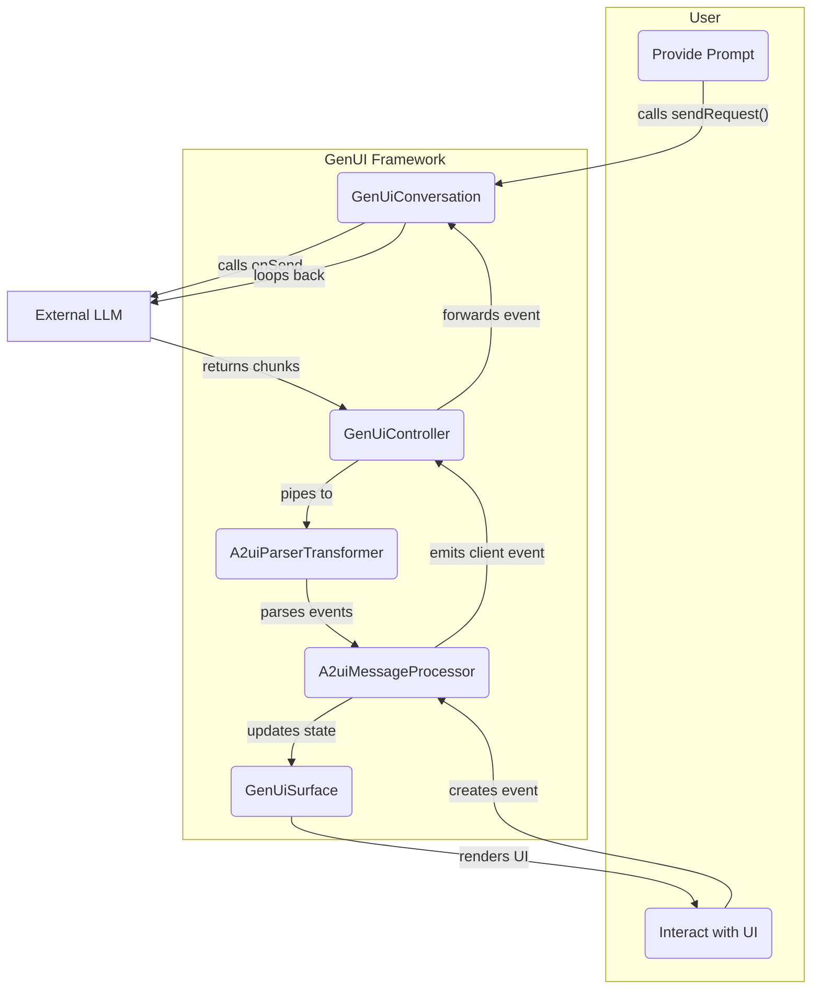

# genui

A Flutter package for building dynamic, conversational user interfaces powered by generative AI models.

`genui` allows you to create applications where the UI is not static or predefined, but is instead constructed by an AI in real-time based on a conversation with the user. This enables highly flexible, context-aware, and interactive user experiences.

This package provides the core functionality for GenUI.

## Features

- **Dynamic UI Generation**: Render Flutter UIs from structured data returned by a generative AI.
- **Simplified Conversation Flow**: A high-level `GenUiConversation` facade manages the interaction loop with the AI.
- **Customizable Widget Catalog**: Define a "vocabulary" of Flutter widgets that the AI can use to build the interface.
- **GenUiController**: High-level controller that manages the input/output pipeline and UI state.
- **Parser Transformer**: `A2uiParserTransformer` for robustly parsing A2UI message streams from text chunks.
- **Event Handling**: Capture user interactions (button clicks, text input), update a client-side data model, and send the state back to the AI as context for the next turn in the conversation.
- **Reactive UI**: Widgets automatically rebuild when the data they are bound to changes in the data model.

## Core Concepts

The package is built around the following main components:

1.  **`GenUiConversation`**: The primary facade and entry point for the package. It encapsulates the `A2uiMessageProcessor` and `ContentGenerator`, manages the conversation history, and orchestrates the entire generative UI process.

2.  **`Catalog`**: A collection of `CatalogItem`s that defines the set of widgets the AI is allowed to use. Each `CatalogItem` specifies a widget's name (for the AI to reference), a data schema for its properties, and a builder function to render the Flutter widget.

3.  **`DataModel`**: A centralized, observable store for all dynamic UI state. Widgets are "bound" to data in this model. When data changes, only the widgets that depend on that specific piece of data are rebuilt.

4.  **`GenUiController`**: The robust controller that manages the pipeline from raw text input to parsed `GenUiUpdate` events. It wraps the `A2uiParserTransformer` and `A2uiMessageProcessor`.

5.  **`A2uiParserTransformer`**: A stream transformer that parses raw text chunks (e.g. from an LLM stream) into structured `GenUiEvent`s (text or A2UI messages).

6.  **`A2uiMessage`**: A message sent from the AI to the UI, instructing it to perform actions like `createSurface`, `updateComponents`, `updateDataModel`, or `deleteSurface`.

## How It Works

The `GenUiConversation` and `GenUiController` manage the interaction cycle:

1. **User Input**: The user provides a prompt. The app calls `genUiConversation.sendRequest()`.
2. **AI Invocation**: The `GenUiConversation` triggers the user-provided `onSend` callback.
3. **Stream Handling**: The app's `onSend` implementation calls the LLM and pipes the response chunks to `GenUiController.addChunk()`.
4. **Parsing**: The `GenUiController` uses `A2uiParserTransformer` to parse chunks into `TextEvent`s or `A2uiMessageEvent`s.
5. **UI State Update**: `A2uiMessageProcessor` (managed by `GenUiController`) handles the messages and updates the `DataModel`.
6. **UI Rendering**: `GenUiSurface` widgets listening to `GenUiController` rebuild automatically.
7. **User Interaction**: User actions (buttons, etc.) trigger events. `GenUiController` captures them and emits `ChatMessage` events on `onClientEvent`.
8. **Loop**: `GenUiConversation` listens to `onClientEvent` and automatically triggers a new request to the AI, continuing the conversation.



See [DESIGN.md](./DESIGN.md) for more detailed information about the design.

## Getting Started with `genui`

This guidance explains how to quickly get started with the
[`genui`](https://pub.dev/packages/genui) package.

### 1. Add `genui` to your app

Use the following instructions to add `genui` to your Flutter app. The
code examples show how to perform the instructions on a brand new app created by
running `flutter create`.

### 2. Configure your agent provider

`genui` can connect to a variety of agent providers. Choose the section
below for your preferred provider.

#### Configure Firebase AI Logic

To use the built-in `FirebaseAiContentGenerator` to connect to Gemini via Firebase AI
Logic, follow these instructions:

1. [Create a new Firebase project](https://support.google.com/appsheet/answer/10104995)
   using the Firebase Console.
2. [Enable the Gemini API](https://firebase.google.com/docs/gemini-in-firebase/set-up-gemini)
   for that project.
3. Follow the first three steps in
   [Firebase's Flutter Setup guide](https://firebase.google.com/docs/flutter/setup)
   to add Firebase to your app.
4. Use `flutter pub add` to add the `genui` and `genui_firebase_ai` packages as
   dependencies in your `pubspec.yaml` file:

   ```bash
   flutter pub add genui genui_firebase_ai
   ```

5. In your app's `main` method, ensure that the widget bindings are initialized,
   and then initialize Firebase.

   ```dart
   void main() async {
     WidgetsFlutterBinding.ensureInitialized();
     await Firebase.initializeApp(options: DefaultFirebaseOptions.currentPlatform);
     runApp(const MyApp());
   }
   ```

#### Configure another agent provider

provider's instructions to configure your app, and then use the `GenUiController`
to parse the streaming output from that provider. The `genui_a2ui` package provides
an example of how to pipe data from an A2A server into the controller.

### 3. Create the connection to an agent

If you build your Flutter project for iOS or macOS, add this key to your
`{ios,macos}/Runner/*.entitlements` file(s) to enable outbound network
requests:

```xml
<dict>
...
<key>com.apple.security.network.client</key>
<true/>
</dict>
```

Next, use the following instructions to connect your app to your chosen agent
provider.

2. Create a `GenUiController`, and provide it with the catalog of widgets you want to make available to the agent.
3. Create a `GenUiConversation` using the `GenUiController`. Implement the `onSend` callback to connect to your AI provider.

   For example:

   ```dart
   class _MyHomePageState extends State<MyHomePage> {
     late final GenUiController _controller;
     late final GenUiConversation _genUiConversation;

     @override
     void initState() {
       super.initState();

       // Create a GenUiController with a widget catalog.
       // The CoreCatalogItems contain basic widgets for text, markdown, and images.
       _controller = GenUiController(catalogs: [CoreCatalogItems.asCatalog()]);

       // Create the GenUiConversation to orchestrate everything.
       _genUiConversation = GenUiConversation(
         controller: _controller,
         onSend: _onSendToLLM,
         onSurfaceAdded: _onSurfaceAdded, // Added in the next step.
         onSurfaceDeleted: _onSurfaceDeleted, // Added in the next step.
       );
     }

     Future<void> _onSendToLLM(ChatMessage message, Iterable<ChatMessage> history) async {
        // Implement your LLM integration here.
        // For example, if using an HTTP client:
        final responseStream = myLlmClient.streamGenerateContent(message, history);
        await for (final chunk in responseStream) {
            _controller.addChunk(chunk);
        }
     }

     @override
     void dispose() {
       _textController.dispose();
       _genUiConversation.dispose();

       super.dispose();
     }
   }
   ```

### 4. Send messages and display the agent's responses

Send a message to the agent using the `sendRequest` method in the `GenUiConversation`
class.

To receive and display generated UI:

1. Use `GenUiConversation`'s callbacks to track the addition and removal of UI surfaces as
   they are generated. These events include a "surface ID" for each surface.
2. Build a `GenUiSurface` widget for each active surface using the surface IDs
   received in the previous step.

   For example:

   ```dart
   class _MyHomePageState extends State<MyHomePage> {

     // ...

     final _textController = TextEditingController();
     final _surfaceIds = <String>[];

     // Send a message containing the user's text to the agent.
     void _sendMessage(String text) {
       if (text.trim().isEmpty) return;
       _genUiConversation.sendRequest(UserMessage.text(text));
     }

     // A callback invoked by the [GenUiConversation] when a new UI surface is generated.
     // Here, the ID is stored so the build method can create a GenUiSurface to
     // display it.
     void _onSurfaceAdded(SurfaceAdded update) {
       setState(() {
         _surfaceIds.add(update.surfaceId);
       });
     }

     // A callback invoked by GenUiConversation when a UI surface is removed.
     void _onSurfaceDeleted(SurfaceRemoved update) {
       setState(() {
         _surfaceIds.remove(update.surfaceId);
       });
     }

     @override
     Widget build(BuildContext context) {
       return Scaffold(
         appBar: AppBar(
           backgroundColor: Theme.of(context).colorScheme.inversePrimary,
           title: Text(widget.title),
         ),
         body: Column(
           children: [
             Expanded(
               child: ListView.builder(
                 itemCount: _surfaceIds.length,
                 itemBuilder: (context, index) {
                   // For each surface, create a GenUiSurface to display it.
                   final id = _surfaceIds[index];
                   return GenUiSurface(host: _genUiConversation.host, surfaceId: id);
                 },
               ),
             ),
             SafeArea(
               child: Padding(
                 padding: const EdgeInsets.symmetric(horizontal: 16.0),
                 child: Row(
                   children: [
                     Expanded(
                       child: TextField(
                         controller: _textController,
                         decoration: const InputDecoration(
                           hintText: 'Enter a message',
                         ),
                       ),
                     ),
                     const SizedBox(width: 16),
                     ElevatedButton(
                       onPressed: () {
                         // Send the user's text to the agent.
                         _sendMessage(_textController.text);
                         _textController.clear();
                       },
                       child: const Text('Send'),
                     ),
                   ],
                 ),
               ),
             ),
           ],
         ),
       );
     }
   }
   ```

### 5. [Optional] Add your own widgets to the catalog

In addition to using the catalog of widgets in `CoreCatalogItems`, you can
create custom widgets for the agent to generate. Use the following
instructions.

#### Depend on the `json_schema_builder` package

Use `flutter pub add` to add `json_schema_builder` as a dependency in
your `pubspec.yaml` file:

```bash
flutter pub add json_schema_builder
```

#### Create the new widget's schema

Each catalog item needs a schema that defines the data required to populate it.
Using the `json_schema_builder` package, define one for the new widget.

```dart
import 'package:json_schema_builder/json_schema_builder.dart';
import 'package:flutter/material.dart';
import 'package:genui/genui.dart';

final _schema = S.object(
  properties: {
    'question': S.string(description: 'The question part of a riddle.'),
    'answer': S.string(description: 'The answer part of a riddle.'),
  },
  required: ['question', 'answer'],
);
```

#### Create a `CatalogItem`

Each `CatalogItem` represents a type of widget that the agent is allowed to
generate. To do that, combines a name, a schema, and a builder function that
produces the widgets that compose the generated UI.

```dart
final riddleCard = CatalogItem(
  name: 'RiddleCard',
  dataSchema: _schema,
  widgetBuilder: (context) {
    final questionNotifier = context.dataContext.subscribeToString(
      context.data['question'] as Map<String, Object?>?,
    );
    final answerNotifier = context.dataContext.subscribeToString(
      context.data['answer'] as Map<String, Object?>?,
    );

    return ValueListenableBuilder<String?>(
      valueListenable: questionNotifier,
      builder: (context, question, _) {
        return ValueListenableBuilder<String?>(
          valueListenable: answerNotifier,
          builder: (context, answer, _) {
            return Container(
              constraints: const BoxConstraints(maxWidth: 400),
              decoration: BoxDecoration(border: Border.all()),
              padding: const EdgeInsets.all(16),
              child: Column(
                crossAxisAlignment: CrossAxisAlignment.start,
                children: [
                  Text(
                    question ?? '',
                    style: Theme.of(context).textTheme.headlineMedium,
                  ),
                  const SizedBox(height: 8.0),
                  Text(
                    answer ?? '',
                    style: Theme.of(context).textTheme.headlineSmall,
                  ),
                ],
              ),
            );
          },
        );
      },
    );
  },
);
```

#### Add the `CatalogItem` to the catalog

Include your catalog items when instantiating `A2uiMessageProcessor`.

```dart
_controller = GenUiController(
  catalogs: [CoreCatalogItems.asCatalog().copyWith([riddleCard])],
);
```

#### Update the system instruction to use the new widget

In order to make sure the agent knows to use your new widget, usage of the prompt engineering techniques is required (e.g. one-shot or few-shot prompting) to explicitly tell it how and when to do so. Provide the name from the CatalogItem when you do.

### Data Model and Data Binding

A core concept in `genui` is the **`DataModel`**, a centralized, observable store for all dynamic UI state. Instead of widgets managing their own state, their state is stored in the `DataModel`.

Widgets are "bound" to data in this model. When data in the model changes, only the widgets that depend on that specific piece of data are rebuilt. This is achieved through a `DataContext` object that is passed to each widget's builder function.

#### Binding to the Data Model

To bind a widget's property to the data model, you use a special JSON object in the data sent from the AI. This object can contain either a `literalString` (for static values) or a `path` (to bind to a value in the data model).

For example, to display a user's name in a `Text` widget, the AI would generate:

```json
{
  "Text": {
    "text": {
      "literalString": "Welcome to GenUI"
    },
    "hint": "h1"
  }
}
```

#### Image

```json
{
  "Image": {
    "url": {
      "literalString": "https://example.com/image.png"
    },
    "hint": "mediumFeature"
  }
}
```

#### Updating the Data Model

Input widgets, like `TextField`, update the `DataModel` directly. When the user types in a text field that is bound to `/user/name`, the `DataModel` is updated, and any other widgets bound to that same path will automatically rebuild to show the new value.

This reactive data flow simplifies state management and creates a powerful, high-bandwidth interaction loop between the user, the UI, and the AI.

### Next steps

Check out the [examples](../../examples) included in this repo! The
[travel app](../../examples/travel_app) shows how to define your own widget
`Catalog` that the agent can use to generate domain-specific UI.

If something is unclear or missing, please
[create an issue](https://github.com/flutter/genui/issues/new/choose).


### Troubleshooting / FAQ

#### How can I configure logging?

To observe communication between your app and the agent, enable logging in your
`main` method.

```dart
import 'package:logging/logging.dart';
import 'package:genui/genui.dart';

final logger = configureGenUiLogging(level: Level.ALL);

void main() async {
  logger.onRecord.listen((record) {
    debugPrint('${record.loggerName}: ${record.message}');
  });

  // Additional initialization of bindings and Firebase.
}
```

#### I'm getting errors about my minimum macOS/iOS version.

Firebase has a
[minimum version requirement](https://firebase.google.com/support/release-notes/ios)
for Apple's platforms, which might be higher than Flutter's default. Check your
`Podfile` (for iOS) and `CMakeLists.txt` (for macOS) to ensure you're targeting
a version that meets or exceeds Firebase's requirements.
