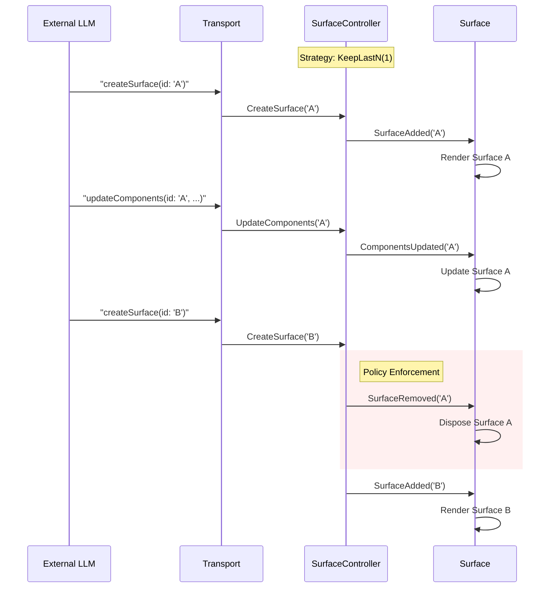

# GenUI API Design: Moving to "Bring Your Own LLM"

## Executive Summary

The current `genui` architecture relies on a `ContentGenerator` abstraction that wraps the LLM interaction, managing both the network connection and the state of the conversation. While this provides a unified interface for the framework, it creates friction for developers who want to integrate GenUI into existing applications with established LLM pipelines (e.g., Genkit, custom loops, or other AI SDKs).

With the shift to A2UI v0.9 and its "Prompt-First" philosophy—where the LLM streams text containing embedded JSON blocks—we have an opportunity to simplify the API. We can decouple the **content source** from the **content parsing and rendering**, allowing developers to "bring their own" LLM inference while still leveraging GenUI's powerful rendering capabilities.

This report proposes a **Unified Architecture** to achieve this goal, combining high-level ease of use with low-level composability.

## Current State

Currently, `Conversation` requires a `ContentGenerator`:

```
abstract interface class ContentGenerator {
  Stream<A2uiMessage> get a2uiMessageStream;
  Stream<String> get textResponseStream;
  Future<void> sendRequest(ChatMessage message, {...});
  // ...
}
```

### Issues

1. **Inversion of Control:** The framework calls `sendRequest`, forcing the developer to implement the API call inside the framework's structure.
2. **State Management Duplication:** The `ContentGenerator` often replicates state management (history, tokens) that might already exist in the developer's app.
3. **Hidden Parsing:** The logic to extract A2UI messages from the text stream is buried within specific `ContentGenerator` implementations (e.g., `GoogleGenerativeAiContentGenerator`), making it hard to reuse just the parser.

## Design Goals

1. **Decoupling:** Separate the *source* of the stream (LLM) from the *consumer* (UI).
2. **Flexibility:** Allow any string stream (WebSocket, local model, mock, HTTP stream) to drive the UI.
3. **Simplicity:** Reduce the boilerplate needed to start rendering A2UI content.
4. **Bi-directionality:** maintain support for client-to-server `Action`s (events) and `ToolCall`s.

## Architecture

The `genui` package adopts a decoupled, event-driven architecture that separates the UI presentation from the transport and state management layers. This design allows developers to bring their own LLM or backend service while leveraging GenUI's rendering capabilities.

The following diagram illustrates the core data flow:


## Class Diagram


### 1. Transport Layer (`lib/src/transport/` and `lib/src/interfaces/`)

This layer handles the pipeline from raw text input (from an LLM) to parsed UI events.

- **`Transport`**: An interface defining the contract for sending and receiving messages.
- **`A2uiTransportAdapter`**: The default implementation of `Transport`. It manages the input stream (`addChunk`), the parsing pipeline, and communicates with the `Conversation`. It uses the `A2uiParserTransformer` to parse streams.
- **`A2uiParserTransformer`**: A robust stream transformer that parses mixed streams of text and A2UI JSON messages. It handles buffering, validation, and conversion of raw strings into structured `GenerationEvent`s.

### 2. UI State Management Layer (`lib/src/engine/`)

This is the central nervous system of the package, orchestrating the state of all generated UI surfaces.

- **`SurfaceController`**: The core state manager for the dynamic UI (formerly `SurfaceController`). It maintains a map of all active UI "surfaces", where each surface is represented by a `UiDefinition`. It takes a `SurfaceConfiguration` object that can restrict AI actions. The AI interacts with the manager by sending structured A2UI messages, which the controller handles via `handleMessage()`. It exposes a stream of `SurfaceUpdate` events (`SurfaceAdded`, `ComponentsUpdated`, `SurfaceRemoved`) so that the application can react to changes. It also owns the `DataModel` to manage the state of individual widgets and implements `SurfaceHost` to provide `SurfaceContext`s for `Surface` widgets.

### 3. UI Model Layer (`lib/src/model/`)

This layer defines the data structures that represent the dynamic UI and the conversation.

- **`Catalog` and `CatalogItem`**: These classes define the registry of available UI components. The `Catalog` holds a list of `CatalogItem`s, and each `CatalogItem` defines a widget's name, its data schema, and a builder function to render it.
- **`A2uiMessage`**: A sealed class (`lib/src/model/a2ui_message.dart`) representing the commands the AI sends to the UI. It has the following subtypes:
  - `CreateSurface`: Signals the start of rendering for a surface, specifying the root component and optionally requests the client to send the data model (`sendDataModel`).
  - `UpdateComponents`: Adds or updates components on a surface.
  - `UpdateDataModel`: Modifies data within the `DataModel` for a surface.
  - `DeleteSurface`: Requests the removal of a surface. The schemas for these messages are defined in `lib/src/model/a2ui_schemas.dart`.
- **`UiDefinition` and `UiEvent`**: `UiDefinition` represents a complete UI tree to be rendered, including the root widget and a map of all widget definitions. `UiEvent` is a data object representing a user interaction. `UserActionEvent` is a subtype used for events that should trigger a submission to the AI, like a button tap.
- **`ChatMessage`**: A sealed class representing the different types of messages in a conversation: `UserMessage`, `AiTextMessage`, `ToolResponseMessage`, `AiUiMessage`, `InternalMessage`, and `UserUiInteractionMessage`.
- **`DataModel` and `DataContext`**: The `DataModel` is a centralized, observable key-value store that holds the entire dynamic state of the UI. Widgets receive a `DataContext`, which is a view into the `DataModel` that understands the widget's current scope. This allows widgets to subscribe to changes in the data model and rebuild reactively. This separation of data and UI structure is a core principle of the architecture.

### 4. Widget Catalog Layer (`lib/src/catalog/`)

This layer provides a set of core, general-purpose UI widgets that can be used out-of-the-box.

- **`SurfaceContext`**: A scoped interface that provides access to the state and behavior of a specific UI surface. It is created by a `SurfaceHost` (like `SurfaceController`).
- **`SurfaceHost`**: The interface that manages multiple surfaces and providers `SurfaceContext`s.
- **`core_catalog.dart`**: Defines the `CoreCatalogItems`, which includes fundamental widgets like `AudioPlayer`, `Button`, `Card`, `CheckBox`, `Column`, `DateTimeInput`, `Divider`, `Icon`, `Image`, `List`, `Modal`, `MultipleChoice`, `Row`, `Slider`, `Tabs`, `Text`, `TextField`, and `Video`.
- **Widget Implementation**: Each core widget follows the standard `CatalogItem` pattern: a schema definition, a type-safe data accessor using an `extension type`, the `CatalogItem` instance, and the Flutter widget implementation.

### 5. UI Facade Layer (`lib/src/facade/`)

This layer provides high-level widgets and controllers for easily building a generative UI application.

- **`Conversation`**: The primary entry point for the package. This facade class encapsulates the `SurfaceController` and `Transport`, managing the conversation loop. It abstracts away the complexity of piping events between the transport and the engine.
- **`Surface`**: The Flutter widget responsible for recursively building a UI tree from a `UiDefinition`. It listens for updates from a `SurfaceContext` (typically obtained from a `SurfaceHost` like `SurfaceController`) and rebuilds itself when the definition changes.

### 6. Primitives Layer (`lib/src/primitives/`)

This layer contains basic utilities used throughout the package.

- **`logging.dart`**: Provides a configurable logger (`genUiLogger`).
- **`simple_items.dart`**: Defines a type alias for `JsonMap`.

### 7. Direct Call Integration (`lib/src/facade/direct_call_integration/`)

This directory provides utilities for a more direct interaction with the AI model, potentially bypassing some of the higher-level abstractions of `Conversation`. It includes:

- **`model.dart`**: Defines data models for direct API calls.
- **`utils.dart`**: Contains utility functions to assist with direct calls.

## How It Works: The Generative UI Cycle

The `Conversation` class simplifies the process of creating a generative UI by managing the conversation loop and the interaction with the AI.


## Surface Lifecycle & Cleanup

When multiple surfaces are generated in a conversation, `SurfaceController` manages them according to a `SurfaceCleanupStrategy`. The default is `ManualCleanupStrategy` (keep all surfaces until explicitly deleted), but `KeepLastNCleanupStrategy` is common for chat interfaces where only the newest UI matters.

### Example: `KeepLastNCleanupStrategy(1)`




## Detailed API Reference

### Core & Entry Points

These classes form the backbone of the GenUI integration in your app.

#### `lib/genui.dart`

**Purpose:** The main entry point for the package. Exports all public APIs.
**Used For:** Import this file to access all GenUI classes.
**Code Example:**

```
import 'package:genui/genui.dart';
```

#### `lib/src/transport/a2ui_transport_adapter.dart`

**Purpose:** The primary transport implementation for interacting with GenUI via **Streaming Text**.
**Used For:** Ideal for "Chat with LLM" scenarios where the model outputs a stream of text that may contain markdown, text, and JSON blocks mixed together.

**Code Example:**

```
final transport = A2uiTransportAdapter(
  onSend: (msg) => myLLMClient.sendMessage(msg),
);
// Feed raw text chunks (e.g. from a streaming API response)
llmStream.listen((chunk) => transport.addChunk(chunk));
```

##### `A2uiTransportAdapter`

- `void addChunk(String text)`: Feed text from LLM.
- `void addMessage(A2uiMessage message)`: Feed a raw A2UI message directly (e.g. from tool output).
- `Stream<String> incomingText`: Stream of text content (markdown) with UI JSON blocks stripped out.
- `Stream<A2uiMessage> incomingMessages`: Stream of parsed A2UI messages.
- `void dispose()`: Closes streams and cleans up resources.

#### `lib/src/engine/surface_controller.dart`

**Purpose:** The central engine for processing Structured A2UI Messages.
**Used For:** Use this directly when you have structured data instead of raw text. Common scenarios include:

1. **Tool Use / Function Calling:** Your LLM returns parsed JSON arguments for a tool call.
2. **Non-LLM Backends:** Your server sends standard JSON payloads (like WebSockets).
3. **Static/Debug Content:** Rendering hardcoded component examples (e.g., `DebugCatalogView`).

**Code Example:**

```
final controller = SurfaceController(catalogs: [myCatalog]);
// Feed a structured message object directly
controller.handleMessage(
  UpdateComponents(surfaceId: 'main', components: [...])
);
```

**Constructor Options used for Cleanup and Constraints:**

- `cleanupStrategy`: Strategies for removing old surfaces (`ManualCleanupStrategy`, `KeepLastNCleanupStrategy`).
- `pendingUpdateTimeout`: Duration to wait for a `CreateSurface` message before discarding orphaned updates.

##### `SurfaceController`

- `Stream<ChatMessage> get onSubmit`: Stream of user interactions (form submissions).
- `Stream<SurfaceUpdate> get surfaceUpdates`: Stream of events when surfaces change.
- `ValueListenable<UiDefinition?> watchSurface(String surfaceId)`: Get the notifier for a surface's UI definition.
- `SurfaceContext contextFor(String surfaceId)`: Get a scoped context for a specific surface.
- `void dispose()`: Cleans up surface notifiers and streams.
- `void handleMessage(A2uiMessage message)`: Processes an incoming `A2uiMessage` (create, update, delete surface).
- `void handleUiEvent(UiEvent event)`: Handle a UI event from a surface.

##### `SurfaceHost` (Interface)

- **The Contract:** Defines how surface managers interact with the backend logic.
- **API:**
- `Stream<SurfaceUpdate> get surfaceUpdates`: Stream of events when surfaces change.
- `SurfaceContext contextFor(String surfaceId)`: Get a scoped context for a specific surface.

##### `SurfaceContext` (Interface)

- **The Contract:** Defines how `Surface` interacts with the backend logic, scoped to a single surface.
- **API:**
- `String get surfaceId`: The ID of the surface.
- `ValueListenable<UiDefinition?> get definition`: The reactive definition of the UI.
- `DataModel get dataModel`: The data model for this surface.
- `Iterable<Catalog> get catalogs`: The catalogs available to this context.
- `void handleUiEvent(UiEvent event)`: Handle a UI event from a surface.

##### `SurfaceUpdate` (Sealed Class)

- Subclasses: `SurfaceAdded`, `ComponentsUpdated`, `SurfaceRemoved`.

#### `lib/src/widgets/genui_surface.dart`

**Purpose:** The Flutter widget that renders a dynamic UI surface.
**Used For:** Place this widget in your app where you want the AI-generated UI to appear.
**Code Example:**

```
Surface(
  genUiContext: myHost.contextFor('main-surface'),
)
```

##### `Surface` (StatefulWidget)

- Constructor: `Surface({required SurfaceContext context, WidgetBuilder? defaultBuilder})`
- The `defaultBuilder` renders a placeholder while the surface definition is empty or loading.


#### `lib/src/facade/conversation.dart`

**Purpose:** High-level abstraction for managing a chat conversation with GenUI support.
**Used For:** Building a chat app where the view binds to a list of messages.
**Code Example:**

```
final conversation = Conversation(
  controller: myController,
  transport: myTransport,
);
```

**`Conversation`**

- `ValueListenable<ConversationState> get state`: The current state (surfaces, latest text, isWaiting).
- `Stream<ConversationEvent> get events`: A stream of events.
- `Future<void> sendRequest(ChatMessage message)`: Sends a message to the LLM.

### Data Models & Protocol

These classes define the data structures and protocol used by GenUI.

#### `lib/src/model/data_model.dart`

**Purpose:** The reactive data store for GenUI surfaces.
**Used For:** Managing state shared between components.

##### `DataModel`

- `void update(DataPath? path, Object? contents)`: Updates data.
- `ValueNotifier<T?> subscribe<T>(DataPath path)`: Subscribe to changes.
- `ValueNotifier<T?> subscribeToValue<T>(DataPath path)`: Subscribe to changes at a specific path only.
- `T? getValue<T>(DataPath path)`: Retrieve a static value without subscribing.
- `void bindExternalState<T>({required DataPath path, required ValueListenable<T> source, bool twoWay})`: Bind an external `ValueNotifier` to the data model.
- `void dispose()`: Disposes resources.

##### `DataPath`

- Parses and represents paths like `/user/name` or relative paths.

##### `DataContext`

- A view of the `DataModel` scoped to a specific path (used by widgets).

#### `lib/src/model/ui_models.dart`

**Purpose:** Core models for UI definition and events.

##### `UiDefinition`

- Represents the state of a surface: `catalogId`, `components` map, `theme`.

##### `UiEvent` & `UserActionEvent`

- Represents events triggered by the user (e.g. button click).

##### `Component`

- Data class for a single widget instance (type, id, properties).

#### `lib/src/model/a2ui_message.dart`

**Purpose:** Defines the messages exchanged in the A2UI protocol.
**Used For:** Parsing server responses.

##### `A2uiMessage` (Sealed Class)

- Subclasses: `CreateSurface`, `UpdateComponents`, `UpdateDataModel`, `DeleteSurface`.
- `factory fromJson(JsonMap json)`: Parses any A2UI message.

#### `lib/src/model/generation_events.dart`

**Purpose:** Events related to the generation process (tokens, tools, text).
**Used For:** Monitoring the stream from the LLM.

##### `GenerationEvent` (Sealed Class)

- Subclasses: `TextEvent`, `A2uiMessageEvent`, `ToolStartEvent`, `ToolEndEvent`, `TokenUsageEvent`.

#### `lib/src/model/a2ui_client_capabilities.dart`

**Purpose:** Describes the client's supported catalogs.
**Used For:** Sending client capabilities to the server/LLM.

##### `A2UiClientCapabilities`

- Hold list of `supportedCatalogIds`.

#### `lib/src/model/a2ui_schemas.dart`

**Purpose:** Provides pre-defined JSON schemas for common data types and validation.
**Used For:** Defining `CatalogItem` schemas concisely.

##### `A2uiSchemas`

- Static methods like `stringReference()`, `numberReference()`, `action()`, `updateComponentsSchema()`, etc.

#### `lib/src/model/chat_message.dart`

**Purpose:** Re-exports `genai_primitives` for chat message models.
**Used For:** Formatting messages for the UI or LLM.

##### `ChatMessageFactories`

- Helpers like `userText` and `modelText`.

#### `lib/src/model/parts.dart` & `parts/ui.dart`

**Purpose:** Extensions to `ChatMessage` parts to support UI payloads.
**Used For:** Handling multimodal messages that include UI definitions.

##### `UiPart`

- Wraps a `UiDefinition` in a message part.

##### `UiInteractionPart`
- Wraps a user interaction event in a message part.

### Catalogs & Component Infrastructure

These classes handle the definition and building of UI components.

#### `lib/src/model/catalog.dart`

**Purpose:** Represents a collection of `CatalogItem`s.
**Used For:** Grouping widgets to provide to the `SurfaceController`.

##### `Catalog`

- `Schema get definition`: Generates the full JSON schema for the catalog (for the LLM).
- `Widget buildWidget(...)`: Builds a widget from the catalog given context.
- `Catalog copyWith(List<CatalogItem> newItems)`: Returns a new catalog with items added/replaced.
- `Catalog copyWithout(Iterable<CatalogItem> itemNames)`: Returns a new catalog with items removed.

#### `lib/src/model/catalog_item.dart`

**Purpose:** Defines a single UI component type.
**Used For:** Creating custom components.
**Code Example:**

```
final myItem = CatalogItem(
  name: 'MyWidget',
  dataSchema: S.object(...),
  widgetBuilder: (context) => MyWidget(...),
);
```

##### `CatalogItem`

- Properties: `name`, `dataSchema`, `widgetBuilder`, `exampleData`.

##### `CatalogItemContext`
- Context object passed to `widgetBuilder`, containing `data`, `dataContext`, `buildChild`, etc.

#### `lib/src/catalog/core_catalog.dart`

**Purpose:** Defines the `CoreCatalogItems` class which provides the standard set of A2UI components.
**Used For:** Use `CoreCatalogItems.asCatalog()` to get a ready-to-use catalog for your `SurfaceController`.
**Code Example:**

```
final controller = SurfaceController(
  catalogs: [CoreCatalogItems.asCatalog()],
);
```

##### `CoreCatalogItems`

- `static Catalog asCatalog()`: Creates a `Catalog` containing all core items (Button, Text, Column, etc.) with the standard A2UI catalog ID.

#### `lib/src/functions/functions.dart`

**Purpose:** Registry of client-side functions available to the A2UI expression system.
**Used For:** Register custom functions that the AI can invoke or use in expressions.

##### `FunctionRegistry`

- `void register(String name, ClientFunction function)`: Add a custom function.
- `Object? invoke(String name, List<Object?> args)`: Call a function.
- `void registerStandardFunctions()`: Registers the default set of functions (e.g. `required`, `regex`, `length`, etc.).

### Utilities & Helpers

#### `lib/src/transport/a2ui_parser_transformer.dart`

**Purpose:** A stream transformer that parses raw text chunks into `GenerationEvent`s.
**Used For:** Piping an LLM text stream into the `SurfaceController`.

##### `A2uiParserTransformer`

- Transforms `Stream<String>` \-\> `Stream<GenerationEvent>`. Handles JSON block extraction and balancing.

#### `lib/src/functions/expression_parser.dart`

**Purpose:** Evaluates `${...}` expressions and logic in A2UI definitions.
**Used For:** Internal use for resolving data bindings and executing client-side logic/validation.

##### `ExpressionParser`

- `Object? parse(String input)`: Parses a string with potential expressions.
- `bool evaluateLogic(JsonMap expression)`: Evaluates a logic object (and/or/not).
- `Object? evaluateFunctionCall(JsonMap callDefinition)`: Evaluates a function call map.

#### `lib/src/utils/json_block_parser.dart`

**Purpose:** Robustly extracts JSON from potentially messy LLM output.
**Used For:** Parsing JSON blocks even if surrounded by markdown or incomplete.

##### `JsonBlockParser`

- `static Object? parseFirstJsonBlock(String text)`
- `static List<Object> parseJsonBlocks(String text)`
- `static String stripJsonBlock(String text)`

#### `lib/src/widgets/widget_utilities.dart`

**Purpose:** Helpers for data binding and widgets.

##### `DataContextExtensions`

- `subscribeToValue<T>`: Helper to create a `ValueNotifier` from a data path or literal.

##### `OptionalValueBuilder`
- Helper widget to build children only when a value is non-null.

#### `lib/src/core/prompt_fragments.dart`

**Purpose:** Contains static strings useful for prompting the LLM.
**Used For:** Injecting instructions into the system prompt.

##### `PromptFragments`

- `basicChat`: A standard prompt block instructing the LLM to use UI tools.

#### `lib/src/model/standard_catalog_embed.dart`

**Purpose:** embedded text resource.
**Used For:** Accessing the standard catalog rules as a string for prompts.

#### `lib/src/primitives/logging.dart`

**Purpose:** Internal logging. **Used For:** Access `genUiLogger`.

#### `lib/src/primitives/cancellation.dart`

**Purpose:** Simple cancellation token pattern.
**Used For:** Cancelling streaming operations.

##### `CancellationSignal`

- Methods: `cancel()`, `addListener()`.

#### `lib/src/primitives/constants.dart`

**Purpose:** Shared constants.
**Used For:** Accessing `standardCatalogId`.

#### `lib/src/primitives/simple_items.dart`

**Purpose:** Typedefs and simple utilities.
**Used For:** `JsonMap` typedef, `generateId()`.

#### `lib/src/widgets/fallback_widget.dart`

**Purpose:** Generic fallback widget for errors/loading.
**Used For:** Displaying errors within the GenUI area.

##### `FallbackWidget`

- Parameters: `error`, `isLoading`, `onRetry`.

#### `lib/src/facade/widgets/chat_primitives.dart`

**Purpose:** Basic widgets for displaying chat messages.
**Used For:** Quickly building a chat interface.

##### `ChatMessageView`

- Displays a simple user or model text message.

##### `InternalMessageView`
- Displays system/debug messages.

### Tooling & Integrations

#### `lib/src/facade/direct_call_integration/model.dart`

**Purpose:** Models for parsing tool calls when using "Direct Tool Call" LLM APIs (like OpenAI function calling).

##### `ToolCall`

- Represents a call to a tool with name and arguments.

##### `ClientFunction`
- Represents the schema of a tool to be sent to the LLM.

#### `lib/src/facade/direct_call_integration/utils.dart`

**Purpose:** Utilities for integrating with LLM tool-calling APIs.

##### `genUiTechPrompt`

- Generates a system prompt explaining how to use the UI tools.

##### `catalogToFunctionDeclaration`
- Converts a `Catalog` into a `ClientFunction` for the LLM.

#### `lib/src/development_utilities/catalog_view.dart`

**Purpose:** A widget for visualizing all items in a catalog using their example data.
**Used For:** Development and debugging of custom catalogs.

##### `DebugCatalogView`

- Renders a list of all components in the provided `Catalog` by rendering their `exampleData`.

### Standard Catalog Items

These are the standard widgets available in the `CoreCatalog`:

* `audioPlayer`
* `button`
* `card`
* `checkBox`
* `choicePicker`
* `column`
* `dateTimeInput`
* `divider`
* `icon`
* `image`
* `imageFixedSize`
* `list`
* `modal`
* `row`
* `slider`
* `tabs`
* `text`
* `textField`
* `video`

#### `lib/src/catalog/core_widgets/widget_helpers.dart`

**Purpose:** Utilities for building standard widget structures like lists with templates.
**Used For:** Used internally by `Column`, `Row`, `List` to handle children building.

##### `ComponentChildrenBuilder`

- A widget that builds children from either an explicit list of IDs or a data-bound template.

##### `buildWeightedChild`

- Helper to wrap a child in `Flexible` if the component definition has a 'weight' property.

## Testing & Validation Strategy

The decoupled architecture requires a robust testing strategy that validates each layer independently and the system as a whole. This is split into **Unit Tests** for the Dart code and **LLM Evals** to verify that models can correctly "speak" the A2UI protocol.

### 1. Dart Unit Tests

We will maintain comprehensive unit test coverage for the framework components, adding new tests as we add new features and fix issues. PRs are required to add new tests and fix existing tests when code changes are made.

### 2. LLM Evals & Validation

Since the "backend" is now any LLM, we must ensure that models can reliably generate valid A2UI commands. We will use a dedicated **Evaluation Framework**, which will be detailed in a separate document.

#### Evaluation Goal

Measure the "A2UI Compliance Rate" of different models when given standard prompts, and track the results over time, ensuring that the framework produces valid A2UI commands at least 95% of the time on three foundation models (Gemini, ChatGPT, Claude).

#### Evaluation Methodology
1.  **Dataset:** A collection of `(Prompt, Expected UI Structure)` pairs.
    *   *Example:* "Create a login form" -> Expect `CreateSurface` with `TextField(username)`, `TextField(password)`, `Button(Login)`.
2.  **Execution:**
    *   Send prompt + standard system instructions (from `PromptFragments`) using the `SurfaceController` logic.
    *   Capture the output stream.
3.  **Validation Metrics:**
    *   **Syntax Validity:** Is the output valid JSON?
    *   **Protocol Compliance:** Does it adhere to the A2UI schema (correct message types, `version: "v0.9"`)?
    *   **Logic Correctness:** Does the generated UI match the intent? (e.g., does the login form actually have a password field?)
    *   **Round-Trip Validity:** Can the generated output be successfully parsed by `A2uiMessage.fromJson` without throwing?

#### CI Integration
*   Run a lightweight subset of evals (using a fast model) on PRs to catch regressions in the system prompts or schema definitions.
*   Run a full evaluation suite nightly to track model performance over time.
