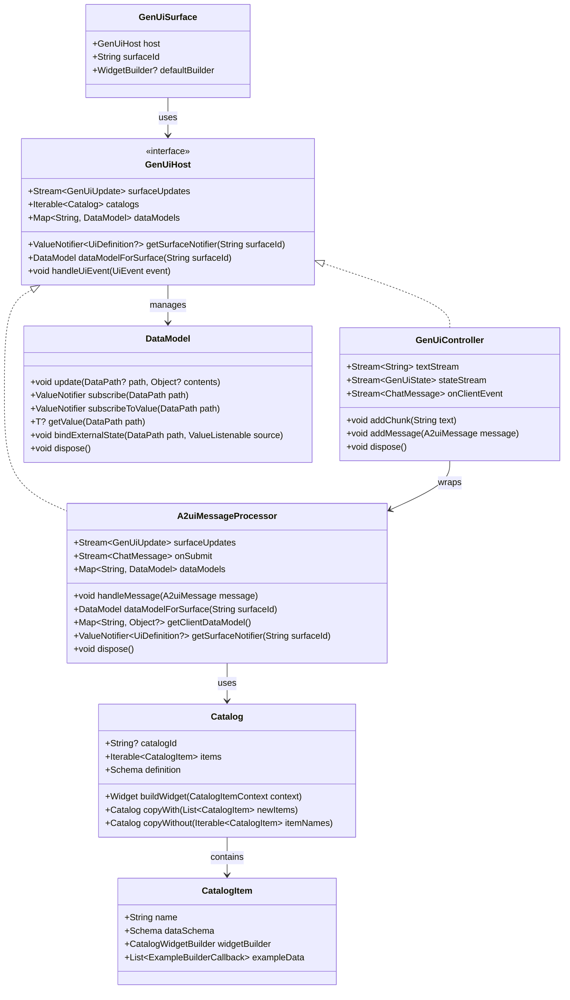

# GenUI Package Guide

## Executive Summary

The `genui` package is the core Flutter client library for the [A2UI (Agent to UI)](https://a2ui.dev) protocol. It enables Flutter applications to render dynamic user interfaces generated by Large Language Models (LLMs) or other backend services in real-time.

**Key Use Cases:**

- **Generative UI:** Stream valid JSON from an LLM to create interactive forms, dashboards, and rich media displays.
- **Dynamic Apps:** Update UI layouts and components remotely without app store updates.
- **Agentic Interactions:** Allow AI agents to present complex data representations and collect structured user input.

**Core functionality includes:**

- **Streaming Protocol:** Parsing `CreateSurface`, `UpdateComponents`, and `UpdateDataModel` messages.
- **State Management:** A robust `DataModel` that supports bidirectional binding between UI components and underlying data.
- **Component System:** An extensible `Catalog` of widgets (`CatalogItem`) that can be customized and expanded.
- **Rendering:** The `GenUiSurface` widget which acts as the host for dynamic content.

## Class Hierarchy



## Detailed API Reference

### Core & Entry Points

These classes form the backbone of the GenUI integration in your app.

#### `lib/genui.dart`

**Purpose:** The main entry point for the package. Exports all public APIs.
**Use Case:** Import this file to access all GenUI classes.
**Code Example:**

```dart
import 'package:genui/genui.dart';
```

#### `lib/src/transport/gen_ui_controller.dart`

**Purpose:** The primary controller for interacting with GenUI via **Streaming Text**.
**Use Case:** Ideal for "Chat with LLM" scenarios where the model outputs a stream of text that may contain markdown, text, and JSON blocks mixed together.
**Code Example:**

```dart
final controller = GenUiController(catalogs: ...);
// Feed raw text chunks (e.g. from a streaming API response)
llmStream.listen((chunk) => controller.addChunk(chunk));
```

**`GenUiController`**

- `void addChunk(String text)`: Feed text from LLM.
- `void addMessage(A2uiMessage message)`: Feed a raw A2UI message directly (e.g. from tool output).
- `Stream<String> textStream`: Stream of text content (markdown) with UI JSON blocks stripped out.
- `Stream<GenUiState> stateStream`: Stream of UI updates (e.g. `SurfaceAdded`, `ComponentsUpdated`).
- `Stream<ChatMessage> onClientEvent`: Stream of user actions to send to LLM.
- `void dispose()`: Closes streams and cleans up resources.
- **Implements `GenUiHost`**: Can be passed directly to `GenUiSurface`.

#### `lib/src/core/a2ui_message_processor.dart`

**Purpose:** The central engine for processing **Structured A2UI Messages**.
**Use Case:** Use this directly when you have structured data instead of raw text. Common scenarios include:

1.  **Tool Use / Function Calling:** Your LLM returns parsed JSON arguments for a tool call.
2.  **Non-LLM Backends:** Your server sends standard JSON payloads (like WebSockets).
3.  **Static/Debug Content:** Rendering hardcoded component examples (e.g., `DebugCatalogView`).

**Code Example:**

```dart
final processor = A2uiMessageProcessor(catalogs: [myCatalog]);
// Feed a structured message object directly
processor.handleMessage(
  UpdateComponents(surfaceId: 'main', components: [...])
);
```

**`A2uiMessageProcessor`**

- `DataModel dataModelForSurface(String surfaceId)`: Access the data model for a specific surface.
- `Map<String, DataModel> get dataModels`: Map of all active data models.
- `Map<String, Object?> getClientDataModel()`: Returns a snapshot of the current data for all attached surfaces.
- `Stream<ChatMessage> get onSubmit`: Stream of user interactions (form submissions).
- `Stream<GenUiUpdate> get surfaceUpdates`: Stream of events when surfaces change.
- `ValueNotifier<UiDefinition?> getSurfaceNotifier(String surfaceId)`: Get the notifier for a surface's UI definition.
- `void dispose()`: Cleans up surface notifiers and streams.
- `void handleMessage(A2uiMessage message)`: Processes an incoming `A2uiMessage` (create, update, delete surface).
- `void handleUiEvent(UiEvent event)`: Handle a UI event from a surface.

**`GenUiHost` (Interface)**

- **The Contract:** Defines how `GenUiSurface` interacts with the backend logic, decoupling UI rendering from message processing.
- **Flexibility:** Allows `GenUiSurface` to work with _any_ backend implementation:
  - Use `GenUiController` for streaming text (LLMs).
  - Use `A2uiMessageProcessor` for structured data (Tools, Databases).
  - Implement your own for custom backends.
- **API:**
- `DataModel dataModelForSurface(String surfaceId)`: Access the data model for a specific surface.
- `Iterable<Catalog> get catalogs`: The catalogs available to this host.
- `Map<String, DataModel> get dataModels`: Map of all active data models.
- `Stream<GenUiUpdate> get surfaceUpdates`: Stream of events when surfaces change.
- `ValueNotifier<UiDefinition?> getSurfaceNotifier(String surfaceId)`: Get the notifier for a surface's UI definition.
- `void handleUiEvent(UiEvent event)`: Handle a UI event from a surface.

**`GenUiUpdate` (Sealed Class)**

- Subclasses: `SurfaceAdded`, `ComponentsUpdated`, `SurfaceRemoved`.

#### `lib/src/core/genui_surface.dart`

**Purpose:** The Flutter widget that renders a dynamic UI surface.
**Use Case:** Place this widget in your app where you want the AI-generated UI to appear.
**Code Example:**

```dart
GenUiSurface(
  host: myGenUiController,
  surfaceId: 'main-surface',
)
```

**`GenUiSurface` (StatefulWidget)**

- Constructor: `GenUiSurface({required GenUiHost host, required String surfaceId, WidgetBuilder? defaultBuilder})`
- The `defaultBuilder` renders a placeholder while the surface definition is empty or loading.

#### `lib/src/widgets/gen_ui_surface_manager.dart`

**Purpose:** Manages a collection of surfaces.
**Use Case:** Automatically displaying all active surfaces (e.g. if the LLM creates multiple).
**`GenUiSurfaceManager`**

- `host`: The `GenUiHost` to watch.
- `layoutBuilder`: Custom layout for the list of surfaces.
- `surfaceBuilder`: Custom builder for individual surfaces (e.g. to wrap them).

#### `lib/src/facade/gen_ui_conversation.dart`

**Purpose:** High-level abstraction for managing a chat conversation with GenUI support.
**Use Case:** Building a chat app where the view binds to a list of messages.
**Code Example:**

```dart
final conversation = GenUiConversation(
  controller: myController,
  onSend: (msg, history) => myLLMClient.sendMessage(msg),
);
```

**`GenUiConversation`**

- `ValueListenable<List<ChatMessage>> get conversation`: The reactive list of chat messages.
- `ValueListenable<bool> get isProcessing`: Whether the conversation is currently waiting for a response.
- `Future<void> sendRequest(ChatMessage message)`: Sends a message to the LLM.
- **Callbacks:** `onSurfaceAdded`, `onComponentsUpdated`, `onSurfaceDeleted`, `onTextResponse`, `onError`.

### Data Models & Protocol

These classes define the data structures and protocol used by GenUI.

#### `lib/src/model/data_model.dart`

**Purpose:** The reactive data store for GenUI surfaces.
**Use Case:** Managing state shared between components.
**`DataModel`**

- `void update(DataPath? path, Object? contents)`: Updates data.
- `ValueNotifier<T?> subscribe<T>(DataPath path)`: Subscribe to changes.
- `ValueNotifier<T?> subscribeToValue<T>(DataPath path)`: Subscribe to changes at a specific path only.
- `T? getValue<T>(DataPath path)`: Retrieve a static value without subscribing.
- `void bindExternalState<T>({required DataPath path, required ValueListenable<T> source, bool twoWay})`: Bind an external `ValueNotifier` to the data model.
- `void dispose()`: Disposes resources.

**`DataPath`**
- Parses and represents paths like `/user/name` or relative paths.

**`DataContext`**
- A view of the `DataModel` scoped to a specific path (used by widgets).

#### `lib/src/model/ui_models.dart`

**Purpose:** Core models for UI definition and events.
**`UiDefinition`**

- Represents the state of a surface: `catalogId`, `components` map, `theme`.

**`UiEvent` & `UserActionEvent`**

- Represents events triggered by the user (e.g. button click).

**`Component`**

- Data class for a single widget instance (type, id, properties).

#### `lib/src/model/a2ui_message.dart`

**Purpose:** Defines the messages exchanged in the A2UI protocol.
**Use Case:** Parsing server responses.
**`A2uiMessage` (Sealed Class)**

- Subclasses: `CreateSurface`, `UpdateComponents`, `UpdateDataModel`, `DeleteSurface`.
- `factory fromJson(JsonMap json)`: Parses any A2UI message.

#### `lib/src/model/gen_ui_events.dart`

**Purpose:** Events related to the generation process (tokens, tools, text).
**Use Case:** Monitoring the stream from the LLM.
**`GenUiEvent` (Sealed Class)**

- Subclasses: `TextEvent`, `A2uiMessageEvent`, `ToolStartEvent`, `ToolEndEvent`, `TokenUsageEvent`.

#### `lib/src/model/a2ui_client_capabilities.dart`

**Purpose:** Describes the client's supported catalogs.
**Use Case:** Sending client capabilities to the server/LLM.
**`A2UiClientCapabilities`**

- Hold list of `supportedCatalogIds`.

#### `lib/src/model/a2ui_schemas.dart`

**Purpose:** Provides pre-defined JSON schemas for common data types and validation.
**Use Case:** Defining `CatalogItem` schemas concisely.
**`A2uiSchemas`**

- Static methods like `stringReference()`, `numberReference()`, `action()`, `updateComponentsSchema()`, etc.

#### `lib/src/model/chat_message.dart`

**Purpose:** Re-exports `genai_primitives` for chat message models.
**Use Case:** Formatting messages for the UI or LLM.
**`ChatMessageFactories`**

- Helpers like `userText` and `modelText`.

#### `lib/src/model/parts.dart` & `parts/ui.dart`

**Purpose:** Extensions to `ChatMessage` parts to support UI payloads.
**Use Case:** Handling multimodal messages that include UI definitions.
**`UiPart`**

- Wraps a `UiDefinition` in a message part.
  **`UiInteractionPart`**
- Wraps a user interaction event in a message part.

### Catalogs & Component Infrastructure

These classes handle the definition and building of UI components.

#### `lib/src/model/catalog.dart`

**Purpose:** Represents a collection of `CatalogItem`s.
**Use Case:** Grouping widgets to provide to the `A2uiMessageProcessor`.
**`Catalog`**

- `Schema get definition`: Generates the full JSON schema for the catalog (for the LLM).
- `Widget buildWidget(...)`: Builds a widget from the catalog given context.
- `Catalog copyWith(List<CatalogItem> newItems)`: Returns a new catalog with items added/replaced.
- `Catalog copyWithout(Iterable<CatalogItem> itemNames)`: Returns a new catalog with items removed.

#### `lib/src/model/catalog_item.dart`

**Purpose:** Defines a single UI component type.
**Use Case:** Creating custom components.
**Code Example:**

```dart
final myItem = CatalogItem(
  name: 'MyWidget',
  dataSchema: S.object(...),
  widgetBuilder: (context) => MyWidget(...),
);
```

**`CatalogItem`**

- Properties: `name`, `dataSchema`, `widgetBuilder`, `exampleData`.
  **`CatalogItemContext`**
- Context object passed to `widgetBuilder`, containing `data`, `dataContext`, `buildChild`, etc.

#### `lib/src/catalog/core_catalog.dart`

**Purpose:** Defines the `CoreCatalogItems` class which provides the standard set of A2UI components.
**Use Case:** Use `CoreCatalogItems.asCatalog()` to get a ready-to-use catalog for your `A2uiMessageProcessor`.
**Code Example:**

```dart
final processor = A2uiMessageProcessor(
  catalogs: [CoreCatalogItems.asCatalog()],
);
```

**`CoreCatalogItems`**

- `static Catalog asCatalog()`: Creates a `Catalog` containing all core items (Button, Text, Column, etc.) with the standard A2UI catalog ID.

#### `lib/src/core/functions.dart`

**Purpose:** Registry of client-side functions available to the A2UI expression system.
**Use Case:** Register custom functions that the AI can invoke or use in expressions.
**`FunctionRegistry`**

- `void register(String name, ClientFunction function)`: Add a custom function.
- `Object? invoke(String name, List<Object?> args)`: Call a function.
- `void registerStandardFunctions()`: Registers the default set of functions (e.g. `required`, `regex`, `length`, etc.).

### Utilities & Helpers

#### `lib/src/transport/a2ui_parser_transformer.dart`

**Purpose:** A stream transformer that parses raw text chunks into `GenUiEvent`s.
**Use Case:** Piping an LLM text stream into the `GenUiController`.
**`A2uiParserTransformer`**

- Transforms `Stream<String>` -> `Stream<GenUiEvent>`. Handles JSON block extraction and balancing.

#### `lib/src/core/expression_parser.dart`

**Purpose:** Evaluates `${...}` expressions and logic in A2UI definitions.
**Use Case:** Internal use for resolving data bindings and executing client-side logic/validation.
**`ExpressionParser`**

- `Object? parse(String input)`: Parses a string with potential expressions.
- `bool evaluateLogic(JsonMap expression)`: Evaluates a logic object (and/or/not).
- `Object? evaluateFunctionCall(JsonMap callDefinition)`: Evaluates a function call map.

#### `lib/src/utils/json_block_parser.dart`

**Purpose:** Robustly extracts JSON from potentially messy LLM output.
**Use Case:** Parsing JSON blocks even if surrounded by markdown or incomplete.
**`JsonBlockParser`**

- `static Object? parseFirstJsonBlock(String text)`
- `static List<Object> parseJsonBlocks(String text)`
- `static String stripJsonBlock(String text)`

#### `lib/src/core/widget_utilities.dart`

**Purpose:** Helpers for data binding and widgets.
**`DataContextExtensions`**

- `subscribeToValue<T>`: Helper to create a `ValueNotifier` from a data path or literal.
  **`OptionalValueBuilder`**
- Helper widget to build children only when a value is non-null.

#### `lib/src/core/prompt_fragments.dart`

**Purpose:** Contains static strings useful for prompting the LLM.
**Use Case:** Injecting instructions into the system prompt.
**`GenUiPromptFragments`**

- `basicChat`: A standard prompt block instructing the LLM to use UI tools.

#### `lib/src/model/standard_catalog_embed.dart`

**Purpose:** embedded text resource.
**Use Case:** Accessing the standard catalog rules as a string for prompts.

#### `lib/src/primitives/logging.dart`

**Purpose:** Internal logging.
**Use Case:** Access `genUiLogger`.

#### `lib/src/primitives/cancellation.dart`

**Purpose:** Simple cancellation token pattern.
**Use Case:** Cancelling streaming operations.
**`CancellationSignal`**

- Methods: `cancel()`, `addListener()`.

#### `lib/src/primitives/constants.dart`

**Purpose:** Shared constants.
**Use Case:** Accessing `standardCatalogId`.

#### `lib/src/primitives/simple_items.dart`

**Purpose:** Typedefs and simple utilities.
**Use Case:** `JsonMap` typedef, `generateId()`.

#### `lib/src/widgets/gen_ui_fallback.dart`

**Purpose:** Generic fallback widget for errors/loading.
**Use Case:** Displaying errors within the GenUI area.
**`GenUiFallback`**

- Parameters: `error`, `isLoading`, `onRetry`.

#### `lib/src/facade/widgets/chat_primitives.dart`

**Purpose:** Basic widgets for displaying chat messages.
**Use Case:** Quickly building a chat interface.
**`ChatMessageView`**

- Displays a simple user or model text message.
  **`InternalMessageView`**
- Displays system/debug messages.

### Tooling & Integrations

#### `lib/src/facade/direct_call_integration/model.dart`

**Purpose:** Models for parsing tool calls when using "Direct Tool Call" LLM APIs (like OpenAI function calling).
**`ToolCall`**

- Represents a call to a tool with name and arguments.
  **`GenUiFunctionDeclaration`**
- Represents the schema of a tool to be sent to the LLM.

#### `lib/src/facade/direct_call_integration/utils.dart`

**Purpose:** Utilities for integrating with LLM tool-calling APIs.
**`genUiTechPrompt`**

- Generates a system prompt explaining how to use the UI tools.
  **`catalogToFunctionDeclaration`**
- Converts a `Catalog` into a `GenUiFunctionDeclaration` for the LLM.

#### `lib/src/development_utilities/catalog_view.dart`

**Purpose:** A widget for visualizing all items in a catalog using their example data.
**Use Case:** Development and debugging of custom catalogs.
**`DebugCatalogView`**

- Renders a list of all components in the provided `Catalog` by rendering their `exampleData`.

### Standard Catalog Items

These are the standard widgets available in the `CoreCatalog`.

#### `lib/src/catalog/core_widgets/audio_player.dart`

**Purpose:** Defines the `AudioPlayer` component.
**Use Case:** playback of audio from a URL.
**Code Example:**

```json
{
  "id": "player",
  "component": "AudioPlayer",
  "url": "https://example.com/audio.mp3"
}
```

**`audioPlayer` (Top-level `CatalogItem`)**

- **Schema:** Requires `url` (string).

#### `lib/src/catalog/core_widgets/button.dart`

**Purpose:** Defines the `Button` component.
**Use Case:** Triggering actions or functions.
**Code Example:**

```json
{
  "component": "Button",
  "child": "btnText",
  "action": { "event": { "name": "submit" } }
}
```

**`button` (Top-level `CatalogItem`)**

- **Schema:** Requires `child` (component ID), `action` (event or function call). Optional `variant` ('primary' or 'borderless').

#### `lib/src/catalog/core_widgets/card.dart`

**Purpose:** Defines the `Card` component.
**Use Case:** Grouping content in a container with a shadow and rounded corners.
**Code Example:**

```json
{
  "component": "Card",
  "child": "contentId"
}
```

**`card` (Top-level `CatalogItem`)**

- **Schema:** Requires `child` (component ID).

#### `lib/src/catalog/core_widgets/check_box.dart`

**Purpose:** Defines the `CheckBox` component.
**Use Case:** Boolean input from the user.
**Code Example:**

```json
{
  "component": "CheckBox",
  "label": "Accept Terms",
  "value": { "path": "/accepted" }
}
```

**`checkBox` (Top-level `CatalogItem`)**

- **Schema:** Requires `label` (string) and `value` (boolean or data binding).

#### `lib/src/catalog/core_widgets/choice_picker.dart`

**Purpose:** Defines the `ChoicePicker` component.
**Use Case:** Single or multiple selection from a list of options (Radio buttons or Checkboxes).
**Code Example:**

```json
{
  "component": "ChoicePicker",
  "variant": "multipleSelection",
  "label": "Choose toppings",
  "options": [{ "label": "Cheese", "value": "cheese" }],
  "value": { "path": "/toppings" }
}
```

**`choicePicker` (Top-level `CatalogItem`)**

- **Schema:** Requires `options` (list of label/value), `value` (list of selected strings), and optional `variant` ('mutuallyExclusive' or 'multipleSelection').

#### `lib/src/catalog/core_widgets/column.dart`

**Purpose:** Defines the `Column` layout component.
**Use Case:** Vertical arrangement of children.
**Code Example:**

```json
{
  "component": "Column",
  "children": ["header", "body", "footer"],
  "justify": "start"
}
```

**`column` (Top-level `CatalogItem`)**

- **Schema:** Requires `children` (list of IDs). Optional `justify` (main axis) and `align` (cross axis).

#### `lib/src/catalog/core_widgets/date_time_input.dart`

**Purpose:** Defines the `DateTimeInput` component.
**Use Case:** Selecting dates and/or times.
**Code Example:**

```json
{
  "component": "DateTimeInput",
  "variant": "date",
  "label": "Birthday",
  "value": { "path": "/birthday" }
}
```

**`dateTimeInput` (Top-level `CatalogItem`)**

- **Schema:** Requires `value` (string YYYY-MM-DD or ISO 8601). Optional `variant` ('date', 'time', 'datetime'), `min`, `max`, `label`.

#### `lib/src/catalog/core_widgets/divider.dart`

**Purpose:** Defines the `Divider` component.
**Use Case:** Visual separation of content.
**Code Example:**

```json
{
  "component": "Divider",
  "axis": "horizontal"
}
```

**`divider` (Top-level `CatalogItem`)**

- **Schema:** Optional `axis` ('horizontal', 'vertical').

#### `lib/src/catalog/core_widgets/icon.dart`

**Purpose:** Defines the `Icon` component.
**Use Case:** Displaying material icons.
**Code Example:**

```json
{
  "component": "Icon",
  "name": "home"
}
```

**`icon` (Top-level `CatalogItem`)**

- **Schema:** Requires `name` (string, must match `AvailableIcons` enum).

#### `lib/src/catalog/core_widgets/image.dart`

**Purpose:** Defines the `Image` component.
**Use Case:** Displaying images from URLs or assets.
**Code Example:**

```json
{
  "component": "Image",
  "url": "https://example.com/pic.jpg",
  "usageHint": "mediumFeature"
}
```

**`image` (Top-level `CatalogItem`)**

- **Schema:** Requires `url`. Optional `fit` and `usageHint`.

**`imageFixedSize` (Top-level `CatalogItem`)**

- **Purpose:** Same as `image` but without `usageHint` exposed to LLM, enforcing a fixed size.

#### `lib/src/catalog/core_widgets/list.dart`

**Purpose:** Defines the `List` component (wrapper for `ListView`).
**Use Case:** Scrollable list of children.
**Code Example:**

```json
{
  "component": "List",
  "direction": "vertical",
  "children": ["item1", "item2"]
}
```

**`list` (Top-level `CatalogItem`)**

- **Schema:** Requires `children` (list of IDs). Optional `direction`.

#### `lib/src/catalog/core_widgets/modal.dart`

**Purpose:** Defines the `Modal` component.
**Use Case:** Configuring a modal sheet that can be opened by a trigger widget.
**Code Example:**

```json
{
  "component": "Modal",
  "trigger": "openBtn",
  "content": "modalContent"
}
```

**`modal` (Top-level `CatalogItem`)**

- **Schema:** Requires `trigger` (component ID) and `content` (component ID).

#### `lib/src/catalog/core_widgets/row.dart`

**Purpose:** Defines the `Row` layout component.
**Use Case:** Horizontal arrangement of children.
**Code Example:**

```json
{
  "component": "Row",
  "children": ["leftIcon", "rightText"],
  "justify": "spaceBetween"
}
```

**`row` (Top-level `CatalogItem`)**

- **Schema:** Requires `children`. Optional `justify` and `align`.

#### `lib/src/catalog/core_widgets/slider.dart`

**Purpose:** Defines the `Slider` component.
**Use Case:** Selecting a numeric value from a range.
**Code Example:**

```json
{
  "component": "Slider",
  "min": 0,
  "max": 100,
  "value": { "path": "/volume" }
}
```

**`slider` (Top-level `CatalogItem`)**

- **Schema:** Requires `value` (number). Optional `min`, `max`.

#### `lib/src/catalog/core_widgets/tabs.dart`

**Purpose:** Defines the `Tabs` component.
**Use Case:** Tabbed navigation between different components.
**Code Example:**

```json
{
  "component": "Tabs",
  "tabs": [
    { "label": "Tab 1", "content": "content1" },
    { "label": "Tab 2", "content": "content2" }
  ]
}
```

**`tabs` (Top-level `CatalogItem`)**

- **Schema:** Requires `tabs` (list of label/content pairs). Optional `activeTab` binding.

#### `lib/src/catalog/core_widgets/text.dart`

**Purpose:** Defines the `Text` component.
**Use Case:** Displaying styled text (supports Markdown).
**Code Example:**

```json
{
  "component": "Text",
  "text": "Hello **World**",
  "variant": "h1"
}
```

**`text` (Top-level `CatalogItem`)**

- **Schema:** Requires `text`. Optional `variant` (style).

#### `lib/src/catalog/core_widgets/text_field.dart`

**Purpose:** Defines the `TextField` component.
**Use Case:** User text input.
**Code Example:**

```json
{
  "component": "TextField",
  "label": "Your Name",
  "value": { "path": "/name" },
  "variant": "shortText"
}
```

**`textField` (Top-level `CatalogItem`)**

- **Schema:** Optional `value`, `label`, `variant`, `validationRegexp`, `onSubmittedAction`.

#### `lib/src/catalog/core_widgets/video.dart`

**Purpose:** Defines the `Video` component.
**Use Case:** Playing video from a URL.
**Code Example:**

```json
{
  "component": "Video",
  "url": "https://example.com/clip.mp4"
}
```

**`video` (Top-level `CatalogItem`)**

- **Schema:** Requires `url`.

#### `lib/src/catalog/core_widgets/widget_helpers.dart`

**Purpose:** Utilities for building standard widget structures like lists with templates.
**Use Case:** Used internally by `Column`, `Row`, `List` to handle children building.

**`ComponentChildrenBuilder`**

- A widget that builds children from either an explicit list of IDs or a data-bound template.

**`buildWeightedChild`**

- Helper to wrap a child in `Flexible` if the component definition has a 'weight' property.
