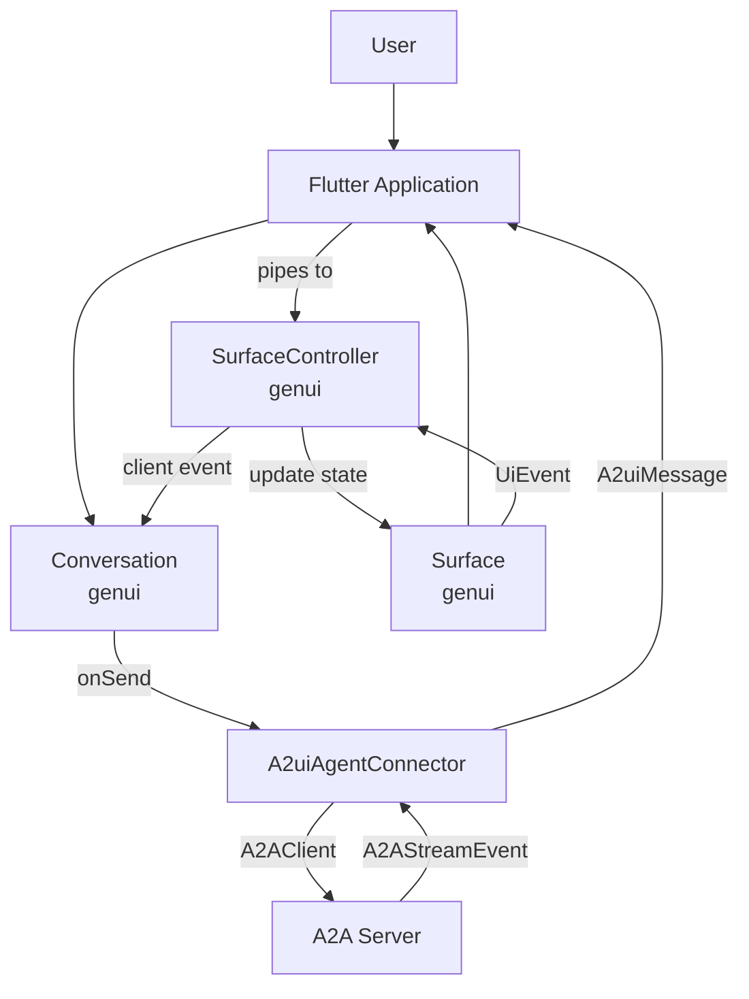

# Design Document: `genui_a2ui`

## Overview

This document outlines the design for the `genui_a2ui` package, an integration layer connecting the `genui` framework with servers implementing the [A2UI Streaming UI Protocol](https://a2ui.org). Its primary purpose is to enable Flutter applications to dynamically render UIs and handle interactions based on messages received from an A2A (Agent-to-Agent) server.

## Goal

To provide a seamless and robust way for Flutter applications using `genui` to consume A2UI streams, leveraging `genui`'s existing capabilities for UI rendering and state management, without tightly coupling the core `genui` package to the A2A protocol specifics.

## Core Components & Design

The architecture of `genui_a2ui` revolves around two main classes:

1.  **`A2uiAgentConnector`**: This class encapsulates the low-level details of the A2A protocol, using the `package:a2a` client library.
    -   Handles WebSocket connection management.
    -   Constructs and sends A2A messages (including user input and UI events).
    -   Receives `A2AStreamEvent`s from the server.
    -   Parses `A2ADataPart`s within the events to extract JSON-encoded A2UI messages.
    -   Exposes streams of `A2uiMessage` and text events that can be piped into a `SurfaceController`.
    -   Manages conversation state like `taskId` and `contextId` as provided by the A2A server.

### Data Flow

1.  User input is sent via `Conversation.sendRequest`, which triggers the `onSend` callback.
2.  The callback delegates to `A2uiAgentConnector` to send the message to the A2A Server.
3.  The server streams back `A2AStreamEvent`s containing A2UI messages.
4.  `A2uiAgentConnector` parses these into `A2uiMessage` objects.
5.  The application (via manual piping) forwards these messages to `SurfaceController`.
6.  `SurfaceController` processes the message and updates the surface state.
7.  The state change causes `Surface` to re-render.
8.  User interactions on `Surface` generate `UiEvent`s, which are captured by `SurfaceController`, passed to `Conversation`, and then sent back to the server via `A2uiAgentConnector` in the `onSend` callback.

### Alternatives Considered

-   **Embedding A2A logic directly in `genui`**: Rejected to keep the core framework decoupled from specific communication protocols.
-   **Re-implementing rendering logic**: Rejected in favor of leveraging `genui`'s established `SurfaceController` and `Surface` for UI rendering and state management.

The chosen approach of a separate integration package (`genui_a2ui`) provides the best separation of concerns.

## Summary

`genui_a2ui` provides the `A2uiAgentConnector` which acts as a transport bridge between an A2A server and the `genui` framework. By piping its output streams into `SurfaceController`, developers can drive a dynamic Flutter UI from an A2A backend.
